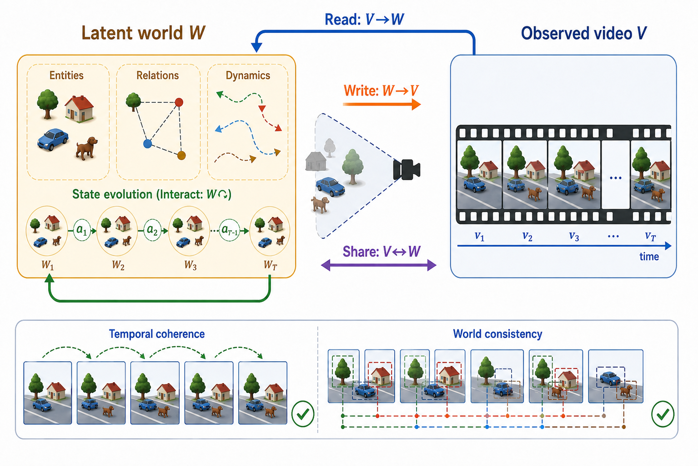
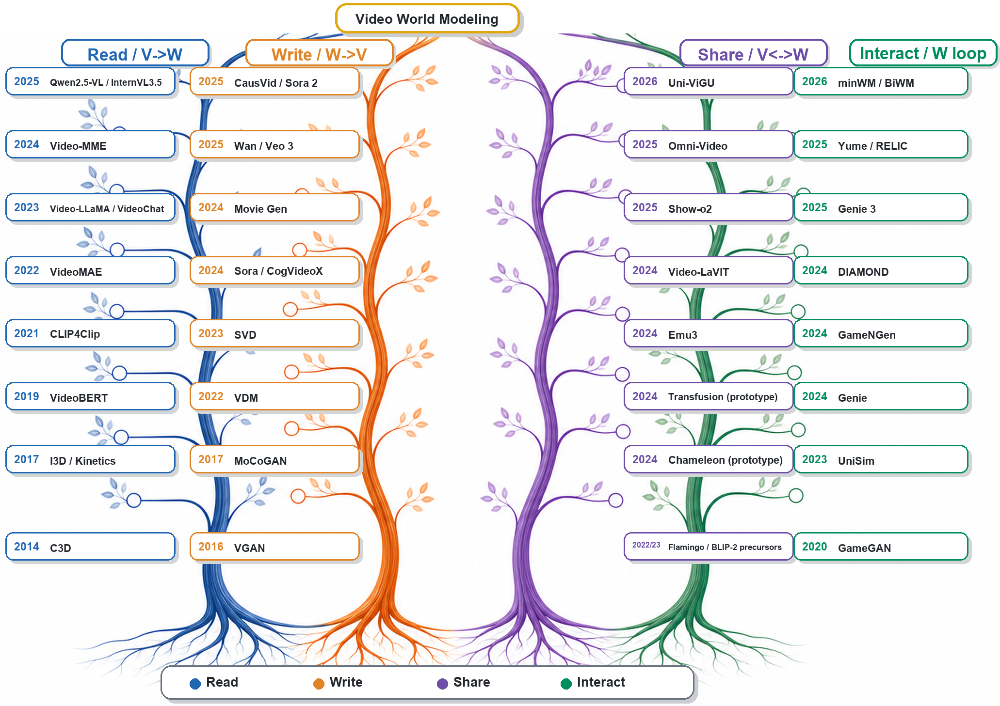

# Reading, Writing, Sharing, and Interacting with the World through Video

### A Survey of Video Foundation Models through the Lens of World Modeling

**Meng Luo · Shengqiong Wu · Bobo Li · Hao Fei**

  

This repository accompanies our survey of video foundation models through a unified
**video-world lens**. We organize the field around four operations on the relation
between an observed video trace and its latent world: **Reading**, **Writing**,
**Sharing**, and **Interacting**.

The catalog contains **504 references actually cited by the manuscript**.
Every entry is assigned from its location in the LaTeX source, and papers used across
multiple themes remain cross-indexed in the [interactive explorer](https://vid-gen.github.io/Awesome-Video-World-Model/#papers).

## News

- **2026-07-28** · Repository and searchable survey website released.
- **Preprint forthcoming** · The public paper link and formal citation will be added here.

## World-Modeling Lens

| Operation | Core question | Survey scope |
|:--|:--|:--|
| **Reading** | What world structure can be inferred from video? | Understanding, representation learning, multimodal reasoning, and video agents |
| **Writing** | How can a coherent video trace be generated? | Latent representations, generation paradigms, conditioning, control, and editing |
| **Sharing** | What can understanding and generation share? | Tokens, latent spaces, modules, training objectives, and tool-level orchestration |
| **Interacting** | How does the world evolve under actions or conditions? | Online rollout, open-loop prediction, latent-state dynamics, memory, and planning |

  

## Contents

- [Explore the collection](https://vid-gen.github.io/Awesome-Video-World-Model/#papers)
- [Download the complete BibTeX file](data/references.bib)
- [Foundations](#foundations)
- [Reading the World](#reading-the-world)
- [Writing the World](#writing-the-world)
- [Sharing the World](#sharing-the-world)
- [Interacting with the World](#interacting-with-the-world)
- [Open Frontiers](#open-frontiers)
- [Contributing](#contributing)

## Paper Collection

> The list below gives each paper one primary location for readability. The website
> exposes every cross-listing recorded in the survey.

### Foundations (68)

Definitions, scenarios, generative foundations, and the Type A/B/C world-model taxonomy.

#### Generative Modeling Foundations (3)

- **[Masked autoencoders are scalable vision learners](https://doi.org/10.1109/cvpr52688.2022.01553)** · Kaiming He et al. · *CVPR, 2022* · `he2022masked`
- **[MaskGIT: Masked Generative Image Transformer](https://doi.org/10.1109/cvpr52688.2022.01103)** · Huiwen Chang et al. · *CVPR, 2022* · `chang2022maskgit`
- **[Deep unsupervised learning using nonequilibrium thermodynamics](https://arxiv.org/abs/1503.03585)** · Jascha Sohl-Dickstein et al. · *ICML, 2015* · `sohl2015deep`

#### Introduction (11)

- **[Audio-Visual Intelligence in Large Foundation Models](https://arxiv.org/abs/2605.04045)** · You Qin et al. · *arXiv, 2026* · `qin2026audiovisual`
- **[GenAgent: Scaling Text-to-Image Generation via Agentic Multimodal Reasoning](https://arxiv.org/abs/2601.18543)** · Kaixun Jiang et al. · *arXiv, 2026* · `jiang2026genagent`
- **[Towards Interactive Video World Modeling: Frontiers, Challenges, Benchmarks, and Future Trends](https://arxiv.org/abs/2606.01164)** · Jiuming Liu et al. · *arXiv, 2026* · `liu2026interactivevideoworld`
- **[Video-o3: Native Interleaved Clue Seeking for Long Video Multi-Hop Reasoning](https://arxiv.org/abs/2601.23224)** · Xiangyu Zeng et al. · *arXiv, 2026* · `zeng2026videoo3`
- **[3D and 4D World Modeling: A Survey](https://arxiv.org/abs/2509.07996)** · Lingdong Kong et al. · *arXiv, 2025* · `kong2025world3d4d`
- **[A survey on long video generation: Challenges, methods, and prospects](https://arxiv.org/abs/2403.16407)** · Chengxuan Li et al. · *arXiv, 2024* · `li2024survey`
- **[TimeChat: A Time-sensitive Multimodal Large Language Model for Long Video Understanding](https://openaccess.thecvf.com/content/CVPR2024/html/Ren_TimeChat_A_Time-sensitive_Multimodal_Large_Language_Model_for_Long_Video_CVPR_2024_paper.html)** · Shuhuai Ren et al. · *CVPR, 2024* · `ren2024timechat`
- **[Understanding World or Predicting Future? A Comprehensive Survey of World Models](https://arxiv.org/abs/2411.14499)** · Jingtao Ding et al. · *arXiv, 2024* · `ding2024worldmodelsurvey`
- **[A Survey on Multimodal Large Language Models](https://arxiv.org/abs/2306.13549)** · Shukang Yin et al. · *arXiv, 2023* · `yin2023mllmsurvey`
- **[VideoControlNet: A Motion-Guided Video-to-Video Translation Framework by Using Diffusion Model with ControlNet](https://arxiv.org/abs/2307.14073)** · Zhihao Hu and Dong Xu · *arXiv, 2023* · `hu2023videocontrolnet`
- **[A Path Towards Autonomous Machine Intelligence](https://openreview.net/forum?id=BZ5a1r-kVsf)** · Yann LeCun · *Project, 2022* · `lecun2022path`

#### Large Language Models (6)

- **[DeepSeek-R1 incentivizes reasoning in LLMs through reinforcement learning](https://doi.org/10.1038/s41586-025-09422-z)** · Daya Guo et al. · *Nature, 2025* · `guo2025deepseek`
- **[BLIP-2: Bootstrapping Language-Image Pre-training with Frozen Image Encoders and Large Language Models](https://proceedings.mlr.press/v202/li23q.html)** · Junnan Li et al. · *ICML, 2023* · `pmlr-v202-li23q`
- **[LLaMA: Open and Efficient Foundation Language Models](https://arxiv.org/abs/2302.13971)** · Hugo Touvron et al. · *arXiv, 2023* · `Touvron2023LLaMAOA`
- **[Finetuned Language Models are Zero-Shot Learners](https://arxiv.org/abs/2109.01652)** · Jason Wei et al. · *ICLR, 2022* · `wei2022finetuned`
- **[Perceiver: General Perception with Iterative Attention](https://arxiv.org/abs/2103.03206)** · Andrew Jaegle et al. · *ICML, 2021* · `jaegle2021perceiver`
- **[Attention is all you need](https://arxiv.org/abs/1706.03762)** · Ashish Vaswani et al. · *NeurIPS, 2017* · `vaswani2017attention`

#### Video Scenarios (6)

- **[RTV-Bench: Benchmarking MLLM Continuous Perception, Understanding and Reasoning through Real-Time Video](https://arxiv.org/abs/2505.02064)** · Shuhang Xun et al. · *arXiv, 2026* · `rtvbench2025`
- **[OVO-Bench: How Far is Your Video-LLMs from Real-World Online Video Understanding?](https://doi.org/10.1109/cvpr52734.2025.01761)** · Junbo Niu et al. · *CVPR, 2025* · `niu2025ovo`
- **[SVBench: A Benchmark with Temporal Multi-Turn Dialogues for Streaming Video Understanding](https://arxiv.org/abs/2502.10810)** · Zhenyu Yang et al. · *ICLR, 2025* · `yang2025svbench`
- **[VGGSound: A Large-scale Audio-Visual Dataset](https://doi.org/10.1109/icassp40776.2020.9053174)** · Honglie Chen et al. · *ICASSP, 2020* · `vggsound2020`
- **[Audio-Visual Event Localization in Unconstrained Videos](https://doi.org/10.1007/978-3-030-01216-8_16)** · Yapeng Tian et al. · *ECCV, 2018* · `ave2018`
- **[Audio Set: An Ontology and Human-Labeled Dataset for Audio Events](https://doi.org/10.1109/icassp.2017.7952261)** · Jort F. Gemmeke et al. · *ICASSP, 2017* · `audioset2017`

#### Video World Models: Definition and Taxonomy (42)

- **[A Definition and Roadmap for World Models](https://arxiv.org/abs/2607.06401)** · Xinyuan Chen et al. · *arXiv, 2026* · `worldmodelroadmap2026`
- **[Aerial World Model for Long-horizon Visual Generation and Navigation in 3D Space](https://arxiv.org/abs/2512.21887)** · Weichen Zhang et al. · *arXiv, 2026* · `aerialworldmodel2026`
- **[BridgeV2W: Bridging Video Generation Models to Embodied World Models via Embodiment Masks](https://arxiv.org/abs/2602.03793)** · Yixiang Chen et al. · *arXiv, 2026* · `chen2026bridgev2w`
- **[ConsisDrive: Identity-Preserving Driving World Models for Video Generation by Instance Mask](https://arxiv.org/abs/2602.03213)** · Zhuoran Yang and Yanyong Zhang · *arXiv, 2026* · `yang2026consisdrive`
- **[Cosmos Policy: Fine-Tuning Video Models for Visuomotor Control and Planning](https://arxiv.org/abs/2601.16163)** · Moo Jin Kim et al. · *arXiv, 2026* · `kim2026cosmospolicy`
- **[Gamma-World: Generative Multi-Agent World Modeling Beyond Two Players](https://arxiv.org/abs/2605.28816)** · Fangfu Liu et al. · *arXiv, 2026* · `gammaworld2026`
- **[MagicWorld: Towards Long-Horizon Stability for Interactive Video World Exploration](https://arxiv.org/abs/2511.18886)** · Guangyuan Li et al. · *arXiv, 2026* · `magicworld2025`
- **[MetaWorld: Scaling Multi-Agent Video World Model from Single-view Video Data](https://arxiv.org/abs/2606.02753)** · Teng Hu et al. · *arXiv, 2026* · `metaworld2026`
- **[MultiWorld: Scalable Multi-Agent Multi-View Video World Models](https://arxiv.org/abs/2604.18564)** · Haoyu Wu et al. · *arXiv, 2026* · `multiworld2026`
- **[NeuralOS: Towards Simulating Operating Systems via Neural Generative Models](https://arxiv.org/abs/2507.08800)** · Luke Rivard et al. · *arXiv, 2026* · `neuralos2025`
- **[SAW: Toward a Surgical Action World Model via Controllable and Scalable Video Generation](https://arxiv.org/abs/2603.13024)** · Sampath Rapuri et al. · *arXiv, 2026* · `rapuri2026saw`
- **[Solaris: Building a Multiplayer Video World Model in Minecraft](https://arxiv.org/abs/2602.22208)** · Georgy Savva et al. · *arXiv, 2026* · `solaris2026`
- **[WorldPlay: Towards Long-Term Geometric Consistency for Real-Time Interactive World Modeling](https://arxiv.org/abs/2512.14614)** · Wenqiang Sun et al. · *arXiv, 2026* · `worldplay2026`
- **[AnimeGamer: Infinite Anime Life Simulation with Next Game State Prediction](https://doi.org/10.1109/iccv51701.2025.01012)** · Junhao Cheng et al. · *ICCV, 2025* · `animegamer2025`
- **[Cosmos-Drive-Dreams: Scalable Synthetic Driving Data Generation with World Foundation Models](https://arxiv.org/abs/2506.09042)** · Xuanchi Ren et al. · *arXiv, 2025* · `cosmosdrivedreams2025`
- **[DiST-4D: Disentangled Spatiotemporal Diffusion with Metric Depth for 4D Driving Scene Generation](https://arxiv.org/abs/2503.15208)** · Jiazhe Guo et al. · *arXiv, 2025* · `guo2025dist4d`
- **[EnerVerse-AC: Envisioning Embodied Environments with Action Condition](https://arxiv.org/abs/2505.09723)** · Yuxin Jiang et al. · *arXiv, 2025* · `enerverseac2025`
- **[EnerVerse: Envisioning Embodied Future Space for Robotics Manipulation](https://arxiv.org/abs/2501.01895)** · Siyuan Huang et al. · *arXiv, 2025* · `enerverse2025`
- **[GameGen-X: Interactive Open-World Game Video Generation](https://arxiv.org/abs/2411.00769)** · Haoxuan Che et al. · *ICLR, 2025* · `gamegenx2024`
- **[Genie 3: A New Frontier for World Models](https://deepmind.google/blog/genie-3-a-new-frontier-for-world-models/)** · Jack Parker-Holder and Shlomi Fruchter · *Project, 2025* · `genie3_2025`
- **[Hunyuan-GameCraft: High-dynamic Interactive Game Video Generation with Hybrid History Condition](https://arxiv.org/abs/2506.17201)** · Jiaqi Li et al. · *arXiv, 2025* · `gamecraft2025`
- **[MiLA: Multi-view Intensive-fidelity Long-term Video Generation World Model for Autonomous Driving](https://arxiv.org/abs/2503.15875)** · Haiguang Wang et al. · *arXiv, 2025* · `wang2025mila`
- **[MineWorld: a Real-Time and Open-Source Interactive World Model on Minecraft](https://arxiv.org/abs/2504.08388)** · Junliang Guo et al. · *arXiv, 2025* · `mineworld2025`
- **[Navigation World Models](https://doi.org/10.1109/cvpr52734.2025.01472)** · Amir Bar et al. · *CVPR, 2025* · `nwm2024`
- **[PAN: A World Model for General, Interactable, and Long-Horizon World Simulation](https://arxiv.org/abs/2511.09057)** · PAN Team et al. · *arXiv, 2025* · `pan2025`
- **[World and Human Action Models towards Gameplay Ideation](https://doi.org/10.1038/s41586-025-08600-3)** · Anssi Kanervisto et al. · *Nature, 2025* · `wham2025`
- **[Yan: Foundational Interactive Video Generation](https://arxiv.org/abs/2508.08601)** · Deheng Ye et al. · *arXiv, 2025* · `yanworld2025`
- **[1X World Model](https://www.1x.tech/discover/1x-world-model)** · 1X Technologies · *Preprint, 2024* · `onex2024worldmodel`
- **[AVID: Adapting Video Diffusion Models to World Models](https://arxiv.org/abs/2410.12822)** · Marc Rigter et al. · *arXiv, 2024* · `rigter2024avid`
- **[EVA: An Embodied World Model for Future Video Anticipation](https://arxiv.org/abs/2410.15461)** · Xiaowei Chi et al. · *arXiv, 2024* · `chi2024eva`
- **[Genie 2: A Large-Scale Foundation World Model](https://deepmind.google/discover/blog/genie-2-a-large-scale-foundation-world-model/)** · Jack Parker-Holder et al. · *Project, 2024* · `genie2_2024`
- **[GR-2: A Generative Video-Language-Action Model with Web-Scale Knowledge for Robot Manipulation](https://arxiv.org/abs/2410.06158)** · Chi-Lam Cheang et al. · *arXiv, 2024* · `cheang2024gr2`
- **[Mastering Diverse Domains through World Models](https://arxiv.org/abs/2301.04104)** · Danijar Hafner et al. · *arXiv, 2024* · `hafner2023dreamerv3`
- **[Oasis: A Universe in a Transformer](https://oasis-model.github.io/)** · Decart et al. · *Project, 2024* · `oasis2024`
- **[Playable Game Generation](https://arxiv.org/abs/2412.00887)** · Mingyu Yang et al. · *arXiv, 2024* · `playgen2024`
- **[The Matrix: Infinite-Horizon World Generation with Real-Time Moving Control](https://arxiv.org/abs/2412.03568)** · Ruili Feng et al. · *arXiv, 2024* · `thematrix2024`
- **[UniMLVG: Unified Framework for Multi-view Long Video Generation with Comprehensive Control Capabilities for Autonomous Driving](https://arxiv.org/abs/2412.04842)** · Rui Chen et al. · *arXiv, 2024* · `chen2024unimlvg`
- **[DrivingDiffusion: Layout-Guided multi-view driving scene video generation with latent diffusion model](https://arxiv.org/abs/2310.07771)** · Xiaofan Li et al. · *arXiv, 2023* · `li2023drivingdiffusion`
- **[Unleashing Large-Scale Video Generative Pre-training for Visual Robot Manipulation](https://arxiv.org/abs/2312.13139)** · Hongtao Wu et al. · *arXiv, 2023* · `wu2023gr1`
- **[Playable Video Generation](https://doi.org/10.1109/cvpr46437.2021.00993)** · Willi Menapace et al. · *CVPR, 2021* · `playablevideo2021`
- **[Learning to Simulate Dynamic Environments with GameGAN](https://doi.org/10.1109/cvpr42600.2020.00131)** · Seung Wook Kim et al. · *CVPR, 2020* · `gamegan2020`
- **[Recurrent World Models Facilitate Policy Evolution](https://arxiv.org/abs/1809.01999)** · David Ha and Jürgen Schmidhuber · *NeurIPS, 2018* · `ha2018worldmodels`

### Reading the World (145)

Video understanding, transferable representations, multimodal models, agents, and applications.

#### Agentic Video Modeling (13)

- **[From Verbatim to Gist: Distilling Pyramidal Multimodal Memory via Semantic Information Bottleneck for Long-Horizon Video Agents](https://arxiv.org/abs/2603.01455)** · Niu Lian et al. · *arXiv, 2026* · `mmmem2026`
- **[IPIBench: Evaluating Interactive Proactive Intelligence of MLLMs under Continuous Streams](https://arxiv.org/abs/2605.27074)** · Jinzhao Li et al. · *arXiv, 2026* · `ipibench2026`
- **[LongVidSearch: An Agentic Benchmark for Multi-hop Evidence Retrieval Planning in Long Videos](https://arxiv.org/abs/2603.14468)** · Rongyi Yu et al. · *arXiv, 2026* · `yu2026longvidsearch`
- **[LongVT: Incentivizing “Thinking with Long Videos” via Native Tool Calling](https://arxiv.org/abs/2511.20785)** · Zuhao Yang et al. · *CVPR, 2026* · `yang2026longvt`
- **[VideoThinker: Building Agentic VideoLLMs with LLM-Guided Tool Reasoning](https://arxiv.org/abs/2601.15724)** · Chenglin Li et al. · *arXiv, 2026* · `li2026videothinker`
- **[Deep Video Discovery: Agentic Search with Tool Use for Long-form Video Understanding](https://arxiv.org/abs/2505.18079)** · Xiaoyi Zhang et al. · *NeurIPS, 2025* · `zhang2025deepvideodiscovery`
- **[SceneRAG: Scene-level Retrieval-Augmented Generation for Video Understanding](https://arxiv.org/abs/2506.07600)** · Nianbo Zeng et al. · *arXiv, 2025* · `zeng2025scenerag`
- **[VideoAgent2: Enhancing the LLM-Based Agent System for Long-Form Video Understanding by Uncertainty-Aware CoT](https://arxiv.org/abs/2504.04471)** · Zhuo Zhi et al. · *arXiv, 2025* · `zhi2025videoagent2`
- **[VideoLucy: Deep Memory Backtracking for Long Video Understanding](https://arxiv.org/abs/2510.12422)** · Jialong Zuo et al. · *NeurIPS, 2025* · `zuo2025videolucy`
- **[VideoRAG: Retrieval-Augmented Generation over Video Corpus](https://arxiv.org/abs/2501.05874)** · Soyeong Jeong et al. · *ACL, 2025* · `jeong2025videoragcorpus`
- **[VideoRAG: Retrieval-Augmented Generation with Extreme Long-Context Videos](https://arxiv.org/abs/2502.01549)** · Xubin Ren et al. · *arXiv, 2025* · `ren2025videoragextreme`
- **[VideoAgent: A Memory-augmented Multimodal Agent for Video Understanding](https://arxiv.org/abs/2403.11481)** · Yue Fan et al. · *ECCV, 2024* · `fan2024videoagentmemory`
- **[VideoAgent: Long-form Video Understanding with Large Language Model as Agent](https://arxiv.org/abs/2403.10517)** · Xiaohan Wang et al. · *arXiv, 2024* · `wang2024videoagentlong`

#### Applications (19)

- **[EgoPolice: A Benchmark for Egocentric Video Understanding in High-Stakes Police Body-Worn Camera Footage](https://arxiv.org/abs/2607.06468)** · Max Gonzalez Saez-Diez et al. · *arXiv, 2026* · `egopolice2026`
- **[Ego-Exo4D: Understanding Skilled Human Activity from First- and Third-Person Perspectives](https://doi.org/10.1007/s11263-025-02557-6)** · Kristen Grauman et al. · *IJCV, 2025* · `grauman2024egoexo4d`
- **[InstructionBench: An Instructional Video Understanding Benchmark](https://arxiv.org/abs/2504.05040)** · Haiwan Wei et al. · *arXiv, 2025* · `wei2025instructionbench`
- **[OmniDrive: A Holistic Vision-Language Dataset for Autonomous Driving with Counterfactual Reasoning](https://doi.org/10.1109/cvpr52734.2025.02090)** · Shihao Wang et al. · *CVPR, 2025* · `wang2025omnidrive`
- **[SURDS: Benchmarking Spatial Understanding and Reasoning in Driving Scenarios with Vision Language Models](https://arxiv.org/abs/2411.13112)** · Xianda Guo et al. · *arXiv, 2025* · `guo2024drivemllm`
- **[SurgVLM: A Large Vision-Language Model and Systematic Evaluation Benchmark for Surgical Intelligence](https://arxiv.org/abs/2506.02555)** · Zhitao Zeng et al. · *arXiv, 2025* · `zeng2025surgvlm`
- **[DriveLM: Driving with Graph Visual Question Answering](https://arxiv.org/abs/2312.14150)** · Chonghao Sima et al. · *ECCV, 2024* · `sima2024drivelm`
- **[EgoSchema: A Diagnostic Benchmark for Very Long-form Video Language Understanding](https://arxiv.org/abs/2308.09126)** · Karttikeya Mangalam et al. · *NeurIPS, 2023* · `mangalam2023egoschema`
- **[Rendezvous: Attention Mechanisms for the Recognition of Surgical Action Triplets in Endoscopic Videos](https://doi.org/10.1016/j.media.2022.102433)** · Chinedu Innocent Nwoye et al. · *Medical Image Analysis, 2022* · `nwoye2022rendezvous`
- **[Rescaling egocentric vision: Collection, pipeline and challenges for epic-kitchens-100](https://arxiv.org/abs/2006.13256)** · Dima Damen et al. · *IJCV, 2022* · `damen2022rescaling`
- **[SoccerNet-v2: A Dataset and Benchmarks for Holistic Understanding of Broadcast Soccer Videos](https://doi.org/10.1109/cvprw53098.2021.00508)** · Adrien Deliege et al. · *CVPRW, 2021* · `deliege2021soccernetv2`
- **[BDD100K: A Diverse Driving Dataset for Heterogeneous Multitask Learning](https://doi.org/10.1109/cvpr42600.2020.00271)** · Fisher Yu et al. · *CVPR, 2020* · `yu2020bdd100k`
- **[nuScenes: A Multimodal Dataset for Autonomous Driving](https://doi.org/10.1109/cvpr42600.2020.01164)** · Holger Caesar et al. · *CVPR, 2020* · `caesar2020nuscenes`
- **[Scalability in Perception for Autonomous Driving: Waymo Open Dataset](https://doi.org/10.1109/cvpr42600.2020.00252)** · Pei Sun et al. · *CVPR, 2020* · `sun2020waymo`
- **[COIN: A Large-scale Dataset for Comprehensive Instructional Video Analysis](https://doi.org/10.1109/cvpr.2019.00130)** · Yansong Tang et al. · *CVPR, 2019* · `tang2019coin`
- **[Cross-Task Weakly Supervised Learning from Instructional Videos](https://doi.org/10.1109/cvpr.2019.00365)** · Dimitri Zhukov et al. · *CVPR, 2019* · `zhukov2019crosstask`
- **[HowTo100M: Learning a Text-Video Embedding by Watching Hundred Million Narrated Video Clips](https://openaccess.thecvf.com/content_ICCV_2019/html/Miech_HowTo100M_Learning_a_Text-Video_Embedding_by_Watching_Hundred_Million_Narrated_ICCV_2019_paper.html)** · Antoine Miech et al. · *ICCV, 2019* · `Miech_2019_ICCV`
- **[SoccerNet: A Scalable Dataset for Action Spotting in Soccer Videos](https://doi.org/10.1109/cvprw.2018.00223)** · Silvio Giancola et al. · *CVPRW, 2018* · `giancola2018soccernet`
- **[EndoNet: A Deep Architecture for Recognition Tasks on Laparoscopic Videos](https://doi.org/10.1109/tmi.2016.2593957)** · Andru P. Twinanda et al. · *TMI, 2017* · `twinanda2016endonet`

#### Foundational Video Modeling (35)

- **[InternVideo3: Agentify Foundation Models with Multimodal Contextual Reasoning](https://arxiv.org/abs/2606.12195)** · Ziang Yan et al. · *arXiv, 2026* · `yan2026internvideo3`
- **[OneThinker: All-in-one Reasoning Model for Image and Video](https://arxiv.org/abs/2512.03043)** · Kaituo Feng et al. · *arXiv, 2026* · `feng2025onethinker`
- **[Video Reasoning without Training](https://arxiv.org/abs/2510.17045)** · Deepak Sridhar et al. · *arXiv, 2026* · `sridhar2025vreason`
- **[VideoChat-A1: Thinking with Long Videos by Chain-of-Shot Reasoning](https://arxiv.org/abs/2506.06097)** · Zikang Wang et al. · *arXiv, 2026* · `wang2025videochata1`
- **[VideoChat3: Fully Open Video MLLM for Efficient and Generalist Video Understanding](https://arxiv.org/abs/2607.14935)** · Xinhao Li et al. · *arXiv, 2026* · `videochat3_2026`
- **[CyberV: Cybernetics for Test-time Scaling in Video Understanding](https://arxiv.org/abs/2506.07971)** · Jiahao Meng et al. · *arXiv, 2025* · `cyberv2025`
- **[FrameThinker: Learning to Think with Long Videos via Multi-Turn Frame Spotlighting](https://arxiv.org/abs/2509.24304)** · Zefeng He et al. · *arXiv, 2025* · `he2025framethinker`
- **[InternVL3.5: Advancing Open-Source Multimodal Models in Versatility, Reasoning, and Efficiency](https://arxiv.org/abs/2508.18265)** · Weiyun Wang et al. · *arXiv, 2025* · `wang2025internvl3`
- **[LongVILA: Scaling Long-Context Visual Language Models for Long Videos](https://arxiv.org/abs/2408.10188)** · Yukang Chen et al. · *ICLR, 2025* · `longvila2024`
- **[Qwen2.5-VL Technical Report](https://arxiv.org/abs/2502.13923)** · Shuai Bai et al. · *arXiv, 2025* · `qwen25vl2025`
- **[Qwen3-VL Technical Report](https://arxiv.org/abs/2511.21631)** · Shuai Bai et al. · *arXiv, 2025* · `bai2025qwen3`
- **[Scaling RL to Long Videos](https://arxiv.org/abs/2507.07966)** · Yukang Chen et al. · *arXiv, 2025* · `chen2025longvilar1`
- **[Select Less, Reason More: Prioritizing Evidence Purity for Video Reasoning](https://arxiv.org/abs/2510.15440)** · Xuchen Li et al. · *arXiv, 2025* · `li2025selectless`
- **[Video-R1: Reinforcing Video Reasoning in MLLMs](https://arxiv.org/abs/2503.21776)** · Kaituo Feng et al. · *arXiv, 2025* · `feng2025videor1`
- **[Video-XL: Extra-Long Vision Language Model for Hour-Scale Video Understanding](https://doi.org/10.1109/cvpr52734.2025.02436)** · Yan Shu et al. · *CVPR, 2025* · `videoxl2024`
- **[VideoChat: Chat-Centric Video Understanding](https://doi.org/10.1007/s11432-024-4321-9)** · Kunchang Li et al. · *Science China Information Sciences, 2025* · `videochat2023`
- **[VideoLLaMA 3: Frontier Multimodal Foundation Models for Image and Video Understanding](https://arxiv.org/abs/2501.13106)** · Boqiang Zhang et al. · *arXiv, 2025* · `videollama3_2025`
- **[VideoTree: Adaptive Tree-based Video Representation for LLM Reasoning on Long Videos](https://doi.org/10.1109/cvpr52734.2025.00311)** · Ziyang Wang et al. · *CVPR, 2025* · `wang2024videotree`
- **[Gemini 1.5: Unlocking multimodal understanding across millions of tokens of context](https://arxiv.org/abs/2403.05530)** · Gemini Team et al. · *arXiv, 2024* · `gemini15_2024`
- **[KeyVideoLLM: Towards Large-scale Video Keyframe Selection](https://arxiv.org/abs/2407.03104)** · Hao Liang et al. · *arXiv, 2024* · `liang2024keyvideollm`
- **[LLaMA-VID: An Image is Worth 2 Tokens in Large Language Models](https://arxiv.org/abs/2311.17043)** · Yanwei Li et al. · *ECCV, 2024* · `li2024llamavid`
- **[LLaVA-OneVision: Easy Visual Task Transfer](https://arxiv.org/abs/2408.03326)** · Bo Li et al. · *arXiv, 2024* · `li2024llava`
- **[Long Context Transfer from Language to Vision](https://arxiv.org/abs/2406.16852)** · Peiyuan Zhang et al. · *arXiv, 2024* · `longva2024`
- **[MA-LMM: Memory-Augmented Large Multimodal Model for Long-Term Video Understanding](https://doi.org/10.1109/cvpr52733.2024.01282)** · Bo He et al. · *CVPR, 2024* · `malmm2024`
- **[MiniCPM-V: A GPT-4V Level MLLM on Your Phone](https://arxiv.org/abs/2408.01800)** · Yuan Yao et al. · *arXiv, 2024* · `yao2024minicpm`
- **[MovieChat: From Dense Token to Sparse Memory for Long Video Understanding](https://doi.org/10.1109/cvpr52733.2024.01725)** · Enxin Song et al. · *CVPR, 2024* · `song2024moviechat`
- **[Video-ChatGPT: Towards Detailed Video Understanding via Large Vision and Language Models](https://aclanthology.org/2024.acl-long.679/)** · Muhammad Maaz et al. · *ACL, 2024* · `maaz-etal-2024-video`
- **[Video-LLaVA: Learning United Visual Representation by Alignment Before Projection](https://aclanthology.org/2024.emnlp-main.342/)** · Bin Lin et al. · *EMNLP, 2024* · `lin2024videollava`
- **[Self-Chained Image-Language Model for Video Localization and Question Answering](https://arxiv.org/abs/2305.06988)** · Shoubin Yu et al. · *NeurIPS, 2023* · `yu2023sevila`
- **[Sigmoid Loss for Language Image Pre-training](https://doi.org/10.1109/iccv51070.2023.01100)** · Xiaohua Zhai et al. · *ICCV, 2023* · `zhai2023sigmoid`
- **[Video-LLaMA: An Instruction-tuned Audio-Visual Language Model for Video Understanding](https://aclanthology.org/2023.emnlp-demo.49/)** · Hang Zhang et al. · *EMNLP, 2023* · `zhang-etal-2023-video`
- **[Visual Instruction Tuning](https://arxiv.org/abs/2304.08485)** · Haotian Liu et al. · *arXiv, 2023* · `liu2023visual`
- **[Flamingo: a Visual Language Model for Few-Shot Learning](https://doi.org/10.52202/068431-1723)** · Jean-Baptiste Alayrac et al. · *NeurIPS, 2022* · `alayrac2022flamingo`
- **[Training Language Models to Follow Instructions with Human Feedback](https://doi.org/10.52202/068431-2011)** · Long Ouyang et al. · *NeurIPS, 2022* · `ouyang2022training`
- **[Learning transferable visual models from natural language supervision](https://arxiv.org/abs/2103.00020)** · Alec Radford et al. · *ICML, 2021* · `radford2021learning`

#### Tasks, Data, and Evaluation (55)

- **[CaST-Bench: Benchmarking Causal Chain-Grounded Spatio-Temporal Reasoning for Video Question Answering](https://arxiv.org/abs/2605.23216)** · Mingfang Zhang et al. · *arXiv, 2026* · `zhang2026castbench`
- **[STEER: Structured Event Evidence for Video Reasoning via Multi-Objective Reinforcement Learning](https://arxiv.org/abs/2604.04415)** · Zinuo Li et al. · *arXiv, 2026* · `li2026causalfact`
- **[Video-MME-v2: Towards the Next Stage in Benchmarks for Comprehensive Video Understanding](https://arxiv.org/abs/2604.05015)** · Chaoyou Fu et al. · *arXiv, 2026* · `videommev2_2026`
- **[VideoOdyssey: A Benchmark for Ultra-Long-Context and Omni-Modal Video Understanding](https://arxiv.org/abs/2605.22907)** · Haichen He et al. · *arXiv, 2026* · `videoodyssey2026`
- **[IntPhys 2: Benchmarking Intuitive Physics Understanding In Complex Synthetic Environments](https://arxiv.org/abs/2506.09849)** · Florian Bordes et al. · *arXiv, 2025* · `intphys2_2025`
- **[LVBench: An Extreme Long Video Understanding Benchmark](https://doi.org/10.1109/iccv51701.2025.02131)** · Weihan Wang et al. · *ICCV, 2025* · `wang2025lvbench`
- **[MLVU: Benchmarking Multi-task Long Video Understanding](https://doi.org/10.1109/cvpr52734.2025.01278)** · Junjie Zhou et al. · *CVPR, 2025* · `zhou2025mlvu`
- **[MMSI-Video-Bench: A Holistic Benchmark for Video-Based Spatial Intelligence](https://arxiv.org/abs/2512.10863)** · Jingli Lin et al. · *arXiv, 2025* · `mmsivideobench2026`
- **[MMVU: Measuring Expert-Level Multi-Discipline Video Understanding](https://doi.org/10.1109/cvpr52734.2025.00793)** · Yilun Zhao et al. · *CVPR, 2025* · `mmvu2025`
- **[Thinking in Space: How Multimodal Large Language Models See, Remember, and Recall Spaces](https://doi.org/10.1109/cvpr52734.2025.00994)** · Jihan Yang et al. · *CVPR, 2025* · `vsibench2024`
- **[TRAVL: A Recipe for Making Video-Language Models Better Judges of Physics Implausibility](https://arxiv.org/abs/2510.07550)** · Saman Motamed et al. · *arXiv, 2025* · `motamed2025travl`
- **[Two Causally Related Needles in a Video Haystack](https://arxiv.org/abs/2505.19853)** · Miaoyu Li et al. · *arXiv, 2025* · `causal2needles2025`
- **[VCRBench: Exploring Long-form Causal Reasoning Capabilities of Large Video Language Models](https://arxiv.org/abs/2505.08455)** · Pritam Sarkar and Ali Etemad · *arXiv, 2025* · `vcrbench2025`
- **[Video-Holmes: Can MLLM Think Like Holmes for Complex Video Reasoning?](https://arxiv.org/abs/2505.21374)** · Junhao Cheng et al. · *arXiv, 2025* · `videoholmes2025`
- **[Video-MME: The First-Ever Comprehensive Evaluation Benchmark of Multi-modal LLMs in Video Analysis](https://doi.org/10.1109/cvpr52734.2025.02245)** · Chaoyou Fu et al. · *CVPR, 2025* · `fu2025video`
- **[Video-MMMU: Evaluating Knowledge Acquisition from Multi-Discipline Professional Videos](https://arxiv.org/abs/2501.13826)** · Kairui Hu et al. · *arXiv, 2025* · `hu2025video`
- **[LongVideoBench: A Benchmark for Long-context Interleaved Video-Language Understanding](https://arxiv.org/abs/2407.15754)** · Haoning Wu et al. · *NeurIPS, 2024* · `wu2024longvideobench`
- **[MMBench-Video: A Long-Form Multi-Shot Benchmark for Holistic Video Understanding](https://arxiv.org/abs/2406.14515)** · Xinyu Fang et al. · *NeurIPS, 2024* · `fang2024mmbench`
- **[SAM 2: Segment Anything in Images and Videos](https://arxiv.org/abs/2408.00714)** · Nikhila Ravi et al. · *arXiv, 2024* · `ravi2024sam2`
- **[TempCompass: Do Video LLMs Really Understand Videos?](https://arxiv.org/abs/2403.00476)** · Yuanxin Liu et al. · *ACL, 2024* · `liu2024tempcompass`
- **[TemporalBench: Benchmarking Fine-grained Temporal Understanding for Multimodal Video Models](https://arxiv.org/abs/2410.10818)** · Mu Cai et al. · *arXiv, 2024* · `temporalbench2024`
- **[MeViS: A Large-scale Benchmark for Video Segmentation with Motion Expressions](https://doi.org/10.1109/iccv51070.2023.00254)** · Henghui Ding et al. · *ICCV, 2023* · `mevis2023`
- **[Tracking Anything with Decoupled Video Segmentation](https://doi.org/10.1109/iccv51070.2023.00127)** · Ho Kei Cheng et al. · *ICCV, 2023* · `cheng2023deva`
- **[Ego4D: Around the World in 3,000 Hours of Egocentric Video](https://doi.org/10.1109/cvpr52688.2022.01842)** · Kristen Grauman et al. · *CVPR, 2022* · `grauman2022ego4d`
- **[Language as Queries for Referring Video Object Segmentation](https://doi.org/10.1109/cvpr52688.2022.00492)** · Jiannan Wu et al. · *CVPR, 2022* · `wu2022referformer`
- **[XMem: Long-Term Video Object Segmentation with an Atkinson-Shiffrin Memory Model](https://arxiv.org/abs/2207.07115)** · Ho Kei Cheng and Alexander G. Schwing · *ECCV, 2022* · `cheng2022xmem`
- **[Associating Objects with Transformers for Video Object Segmentation](https://arxiv.org/abs/2106.02638)** · Zongxin Yang et al. · *NeurIPS, 2021* · `yang2021aot`
- **[NExT-QA: Next Phase of Question-Answering to Explaining Temporal Actions](https://doi.org/10.1109/cvpr46437.2021.00965)** · Junbin Xiao et al. · *CVPR, 2021* · `xiao2021next`
- **[Physion: Evaluating Physical Prediction from Vision in Humans and Machines](https://arxiv.org/abs/2106.08261)** · Daniel M. Bear et al. · *NeurIPS, 2021* · `physion2021`
- **[QVHighlights: Detecting Moments and Highlights in Videos via Natural Language Queries](https://arxiv.org/abs/2107.09609)** · Jie Lei et al. · *NeurIPS, 2021* · `lei2021qvhighlights`
- **[STAR: A Benchmark for Situated Reasoning in Real-World Videos](https://arxiv.org/abs/2405.09711)** · Bo Wu et al. · *NeurIPS, 2021* · `star2024`
- **[CLEVRER: Collision Events for Video Representation and Reasoning](https://arxiv.org/abs/1910.01442)** · Kexin Yi et al. · *ICLR, 2020* · `clevrer2019`
- **[IntPhys: A Framework and Benchmark for Visual Intuitive Physics Reasoning](https://arxiv.org/abs/1803.07616)** · Ronan Riochet et al. · *arXiv, 2020* · `intphys2018`
- **[URVOS: Unified Referring Video Object Segmentation Network with a Large-Scale Benchmark](https://doi.org/10.1007/978-3-030-58555-6_13)** · Seonguk Seo et al. · *ECCV, 2020* · `seo2020urvos`
- **[Where Does It Exist: Spatio-Temporal Video Grounding for Multi-Form Sentences](https://doi.org/10.1109/cvpr42600.2020.01068)** · Zhu Zhang et al. · *CVPR, 2020* · `vidstg2020`
- **[ActivityNet-QA: A Dataset for Understanding Complex Web Videos via Question Answering](https://doi.org/10.1609/aaai.v33i01.33019127)** · Zhou Yu et al. · *AAAI, 2019* · `yu2019activitynet`
- **[LaSOT: A High-quality Benchmark for Large-scale Single Object Tracking](https://doi.org/10.1109/cvpr.2019.00552)** · Heng Fan et al. · *CVPR, 2019* · `lasot2018`
- **[SlowFast Networks for Video Recognition](https://doi.org/10.1109/iccv.2019.00630)** · Christoph Feichtenhofer et al. · *ICCV, 2019* · `feichtenhofer2019slowfast`
- **[VaTeX: A Large-Scale, High-Quality Multilingual Dataset for Video-and-Language Research](https://doi.org/10.1109/iccv.2019.00468)** · Xin Wang et al. · *ICCV, 2019* · `wang2019vatex`
- **[The 2017 DAVIS Challenge on Video Object Segmentation](https://arxiv.org/abs/1704.00675)** · Jordi Pont-Tuset et al. · *arXiv, 2018* · `davis2017`
- **[Towards Automatic Learning of Procedures from Web Instructional Videos](https://doi.org/10.1609/aaai.v32i1.12342)** · Luowei Zhou et al. · *AAAI, 2018* · `zhou2018youcook2`
- **[TVQA: Localized, Compositional Video Question Answering](https://aclanthology.org/D18-1167/)** · Jie Lei et al. · *EMNLP, 2018* · `lei-etal-2018-tvqa`
- **[YouTube-VOS: A Large-Scale Video Object Segmentation Benchmark](https://arxiv.org/abs/1809.03327)** · Ning Xu et al. · *arXiv, 2018* · `youtubevos2018`
- **[Localizing moments in video with natural language](https://doi.org/10.1109/iccv.2017.618)** · Lisa Anne Hendricks et al. · *ICCV, 2017* · `anne2017localizing`
- **[Quo vadis, action recognition? a new model and the kinetics dataset](https://doi.org/10.1109/cvpr.2017.502)** · Joao Carreira and Andrew Zisserman · *CVPR, 2017* · `carreira2017quo`
- **[TALL: Temporal Activity Localization via Language Query](https://doi.org/10.1109/iccv.2017.563)** · Jiyang Gao et al. · *ICCV, 2017* · `charadessta2017`
- **[TGIF-QA: Toward Spatio-Temporal Reasoning in Visual Question Answering](https://doi.org/10.1109/cvpr.2017.149)** · Yunseok Jang et al. · *CVPR, 2017* · `jang2017tgif`
- **[The Kinetics Human Action Video Dataset](https://arxiv.org/abs/1705.06950)** · Will Kay et al. · *arXiv, 2017* · `kay2017kinetics`
- **[The THUMOS Challenge on Action Recognition for Videos “in the Wild”](https://doi.org/10.1016/j.cviu.2016.10.018)** · Haroon Idrees et al. · *CVIU, 2017* · `idrees2017thumos`
- **[The" something something" video database for learning and evaluating visual common sense](https://doi.org/10.1109/iccv.2017.622)** · Raghav Goyal et al. · *ICCV, 2017* · `goyal2017something`
- **[MOT16: A Benchmark for Multi-Object Tracking](https://arxiv.org/abs/1603.00831)** · Anton Milan et al. · *arXiv, 2016* · `motchallenge2016`
- **[MSR-VTT: A Large Video Description Dataset for Bridging Video and Language](https://openaccess.thecvf.com/content_cvpr_2016/html/Xu_MSR-VTT_A_Large_CVPR_2016_paper.html)** · Jun Xu et al. · *CVPR, 2016* · `Xu_2016_CVPR`
- **[ActivityNet: A Large-Scale Video Benchmark for Human Activity Understanding](https://doi.org/10.1109/cvpr.2015.7298698)** · Fabian Caba Heilbron et al. · *CVPR, 2015* · `caba2015activitynet`
- **[UCF101: A Dataset of 101 Human Actions Classes From Videos in The Wild](https://arxiv.org/abs/1212.0402)** · Khurram Soomro et al. · *arXiv, 2012* · `soomro2012ucf101`
- **[HMDB: a large video database for human motion recognition](https://doi.org/10.1109/iccv.2011.6126543)** · H. Kuehne et al. · *ICCV, 2011* · `kuehne2011hmdb`

#### Video Representation Learning and Encoding (23)

- **[Gen4U: Unifying Video Generation and Understanding via Diffusion](https://arxiv.org/abs/2607.06856)** · Michael King et al. · *arXiv, 2026* · `gen4u2026`
- **[V-JEPA 2.1: Unlocking Dense Features in Video Self-Supervised Learning](https://arxiv.org/abs/2603.14482)** · Lorenzo Mur-Labadia et al. · *arXiv, 2026* · `muckley2026vjepa21`
- **[Video Generation Models are General-Purpose Vision Learners](https://arxiv.org/abs/2607.09024)** · Letian Wang et al. · *arXiv, 2026* · `genception2026`
- **[V-JEPA 2: Self-Supervised Video Models Enable Understanding, Prediction and Planning](https://arxiv.org/abs/2506.09985)** · Mido Assran et al. · *arXiv, 2025* · `assran2025vjepa2`
- **[InternVid: A Large-scale Video-Text Dataset for Multimodal Understanding and Generation](https://arxiv.org/abs/2307.06942)** · Yi Wang et al. · *arXiv, 2024* · `wang2023internvid`
- **[InternVideo2: Scaling Foundation Models for Multimodal Video Understanding](https://doi.org/10.1007/978-3-031-73013-9_23)** · Yi Wang et al. · *ECCV, 2024* · `wang2024internvideo2`
- **[Revisiting Feature Prediction for Learning Visual Representations from Video](https://arxiv.org/abs/2404.08471)** · Adrien Bardes et al. · *arXiv, 2024* · `bardes2024vjepa`
- **[Unmasked Teacher: Towards Training-Efficient Video Foundation Models](https://doi.org/10.1109/iccv51070.2023.01826)** · Kunchang Li et al. · *ICCV, 2023* · `li2023unmasked`
- **[VideoCoCa: Video-Text Modeling with Zero-Shot Transfer from Contrastive Captioners](https://arxiv.org/abs/2212.04979)** · Shen Yan et al. · *arXiv, 2023* · `Yan2023VideoCoCa`
- **[VideoMAE V2: Scaling Video Masked Autoencoders with Dual Masking](https://doi.org/10.1109/cvpr52729.2023.01398)** · Limin Wang et al. · *CVPR, 2023* · `wang2023videomae`
- **[CLIP4Clip: An empirical study of CLIP for end to end video clip retrieval and captioning](https://doi.org/10.1016/j.neucom.2022.07.028)** · Huaishao Luo et al. · *Neurocomputing, 2022* · `luo2022clip4clip`
- **[GIT: A Generative Image-to-Text Transformer for Vision and Language](https://arxiv.org/abs/2205.14100)** · Jianfeng Wang et al. · *TMLR, 2022* · `wang2022git`
- **[InternVideo: General Video Foundation Models via Generative and Discriminative Learning](https://arxiv.org/abs/2212.03191)** · Yi Wang et al. · *arXiv, 2022* · `wang2022internvideo`
- **[Masked Feature Prediction for Self-Supervised Visual Pre-Training](https://doi.org/10.1109/cvpr52688.2022.01426)** · Chen Wei et al. · *CVPR, 2022* · `wei2022maskfeat`
- **[Video Swin Transformer](https://doi.org/10.1109/cvpr52688.2022.00320)** · Ze Liu et al. · *CVPR, 2022* · `liu2022videoswin`
- **[VideoMAE: Masked Autoencoders are Data-Efficient Learners for Self-Supervised Video Pre-Training](https://arxiv.org/abs/2203.12602)** · Zhan Tong et al. · *NeurIPS, 2022* · `tong2022videomae`
- **[X-CLIP: End-to-End Multi-grained Contrastive Learning for Video-Text Retrieval](https://doi.org/10.1145/3503161.3547910)** · Yiwei Ma et al. · *ACM MM, 2022* · `ma2022xclip`
- **[A Large-Scale Study on Unsupervised Spatiotemporal Representation Learning](https://doi.org/10.1109/cvpr46437.2021.00331)** · Christoph Feichtenhofer et al. · *CVPR, 2021* · `feichtenhofer2021large`
- **[Frozen in Time: A Joint Video and Image Encoder for End-to-End Retrieval](https://openaccess.thecvf.com/content/ICCV2021/html/Bain_Frozen_in_Time_A_Joint_Video_and_Image_Encoder_for_ICCV_2021_paper.html)** · Max Bain et al. · *ICCV, 2021* · `Bain_2021_ICCV`
- **[Is Space-Time Attention All You Need for Video Understanding?](https://arxiv.org/abs/2102.05095)** · Gedas Bertasius et al. · *ICML, 2021* · `bertasius21timesformer`
- **[Spatiotemporal Contrastive Video Representation Learning](https://doi.org/10.1109/cvpr46437.2021.00689)** · Rui Qian et al. · *CVPR, 2021* · `qian2021cvrl`
- **[VideoCLIP: Contrastive Pre-training for Zero-shot Video-Text Understanding](https://doi.org/10.18653/v1/2021.emnlp-main.544)** · Hu Xu et al. · *EMNLP, 2021* · `xu2021videoclip`
- **[ViViT: A Video Vision Transformer](https://doi.org/10.1109/iccv48922.2021.00676)** · Anurag Arnab et al. · *ICCV, 2021* · `arnab2021vivit`

### Writing the World (135)

Video generation tasks, latent representations, generative paradigms, control, and applications.

#### Applications (14)

- **[Vidu S1: A Real-Time Interactive Video Generation Model](https://arxiv.org/abs/2607.03118)** · Jintao Zhang et al. · *arXiv, 2026* · `vidus1_2026`
- **[DreamGen: Unlocking Generalization in Robot Learning through Video World Models](https://arxiv.org/abs/2505.12705)** · Joel Jang et al. · *arXiv, 2025* · `jang2025dreamgen`
- **[GigaWorld-0: World Models as Data Engine to Empower Embodied AI](https://arxiv.org/abs/2511.19861)** · GigaWorld Team et al. · *arXiv, 2025* · `gigaworld2025`
- **[Movie Gen: A Cast of Media Foundation Models](https://arxiv.org/abs/2410.13720)** · Adam Polyak et al. · *arXiv, 2025* · `polyak2024moviegen`
- **[MuseTalk: Real-Time High-Fidelity Video Dubbing via Spatio-Temporal Sampling](https://arxiv.org/abs/2410.10122)** · Yue Zhang et al. · *arXiv, 2025* · `zhang2024musetalk`
- **[Dreamitate: Real-World Visuomotor Policy Learning via Video Generation](https://arxiv.org/abs/2406.16862)** · Junbang Liang et al. · *arXiv, 2024* · `liang2024dreamitate`
- **[DriveDreamer: Towards Real-world-driven World Models for Autonomous Driving](https://arxiv.org/abs/2309.09777)** · Xiaofeng Wang et al. · *ECCV, 2024* · `wang2024drivedreamer`
- **[Learning Interactive Real-World Simulators](https://arxiv.org/abs/2310.06114)** · Sherry Yang et al. · *ICLR, 2024* · `yang2024unisim`
- **[Learning to Act from Actionless Videos through Dense Correspondences](https://arxiv.org/abs/2310.08576)** · Po-Chen Ko et al. · *ICLR, 2024* · `ko2024avdc`
- **[MagicDrive: Street View Generation with Diverse 3D Geometry Control](https://arxiv.org/abs/2310.02601)** · Ruiyuan Gao et al. · *arXiv, 2024* · `gao2023magicdrive`
- **[Panacea: Panoramic and Controllable Video Generation for Autonomous Driving](https://doi.org/10.1109/cvpr52733.2024.00659)** · Yuqing Wen et al. · *CVPR, 2024* · `wen2023panacea`
- **[RoboDreamer: Learning Compositional World Models for Robot Imagination](https://arxiv.org/abs/2404.12377)** · Siyuan Zhou et al. · *arXiv, 2024* · `zhou2024robodreamer`
- **[GAIA-1: A Generative World Model for Autonomous Driving](https://arxiv.org/abs/2309.17080)** · Anthony Hu et al. · *arXiv, 2023* · `hu2023gaia1`
- **[Learning Universal Policies via Text-Guided Video Generation](https://arxiv.org/abs/2302.00111)** · Yilun Du et al. · *NeurIPS, 2023* · `du2023unipi`

#### Control Strategies (14)

- **[LoRA-Edit: Controllable First-Frame-Guided Video Editing via Mask-Aware LoRA Fine-Tuning](https://arxiv.org/abs/2506.10082)** · Chenjian Gao et al. · *arXiv, 2026* · `gao2025loraedit`
- **[PhysRAG: Enhancing Physics-Awareness in Video Generation via Retrieval-Augmented Generation](https://arxiv.org/abs/2606.26916)** · Kexu Cheng et al. · *arXiv, 2026* · `physrag2026`
- **[Video2LoRA: Unified Semantic-Controlled Video Generation via Per-Reference-Video LoRA](https://arxiv.org/abs/2603.08210)** · Zexi Wu et al. · *arXiv, 2026* · `wu2026video2lora`
- **[VLIPP: Towards Physically Plausible Video Generation with Vision and Language Informed Physical Prior](https://doi.org/10.1109/iccv51701.2025.01149)** · Xindi Yang et al. · *ICCV, 2025* · `yang2025vlipp`
- **[Adding conditional control to text-to-image diffusion models](https://doi.org/10.1109/iccv51070.2023.00355)** · Lvmin Zhang et al. · *ICCV, 2023* · `zhang2023adding`
- **[Diffusion Self-Guidance for Controllable Image Generation](https://arxiv.org/abs/2306.00986)** · Dave Epstein et al. · *arXiv, 2023* · `epstein2023selfguidance`
- **[FreeDoM: Training-Free Energy-Guided Conditional Diffusion Model](https://arxiv.org/abs/2303.09833)** · Jiwen Yu et al. · *arXiv, 2023* · `yu2023freedom`
- **[Prompt-to-Prompt Image Editing with Cross-Attention Control](https://arxiv.org/abs/2208.01626)** · Amir Hertz et al. · *ICLR, 2023* · `hertz2022prompttoprompt`
- **[T2I-Adapter: Learning Adapters to Dig out More Controllable Ability for Text-to-Image Diffusion Models](https://arxiv.org/abs/2302.08453)** · Chong Mou et al. · *arXiv, 2023* · `mou2023t2iadapter`
- **[Universal Guidance for Diffusion Models](https://arxiv.org/abs/2302.07121)** · Arpit Bansal et al. · *arXiv, 2023* · `bansal2023universalguidance`
- **[Classifier-Free Diffusion Guidance](https://arxiv.org/abs/2207.12598)** · Jonathan Ho and Tim Salimans · *arXiv, 2022* · `ho2022classifierfree`
- **[LoRA: Low-Rank Adaptation of Large Language Models](https://arxiv.org/abs/2106.09685)** · Edward J. Hu et al. · *ICLR, 2022* · `hu2021lora`
- **[SDEdit: Guided Image Synthesis and Editing with Stochastic Differential Equations](https://arxiv.org/abs/2108.01073)** · Chenlin Meng et al. · *ICLR, 2022* · `meng2021sdedit`
- **[Denoising Diffusion Implicit Models](https://arxiv.org/abs/2010.02502)** · Jiaming Song et al. · *ICLR, 2021* · `song2021ddim`

#### Generative Video Foundation Modeling (32)

- **[Causal Forcing: Autoregressive Diffusion Distillation Done Right for High-Quality Real-Time Interactive Video Generation](https://arxiv.org/abs/2602.02214)** · Hongzhou Zhu et al. · *arXiv, 2026* · `zhu2026causalforcing`
- **[Lumos-1: On Autoregressive Video Generation with Discrete Diffusion from a Unified Model Perspective](https://arxiv.org/abs/2507.08801)** · Hangjie Yuan et al. · *ICLR, 2026* · `yuan2025lumos`
- **[World-R1: Reinforcing 3D Constraints for Text-to-Video Generation](https://arxiv.org/abs/2604.24764)** · Weijie Wang et al. · *arXiv, 2026* · `worldr1_2026`
- **[Automated Movie Generation via Multi-Agent CoT Planning](https://arxiv.org/abs/2503.07314)** · Weijia Wu et al. · *arXiv, 2025* · `wu2025movieagent`
- **[Autoregressive Video Generation without Vector Quantization](https://arxiv.org/abs/2412.14169)** · Haoge Deng et al. · *arXiv, 2025* · `deng2024nova`
- **[Exploring MLLM-Diffusion Information Transfer with MetaCanvas](https://arxiv.org/abs/2512.11464)** · Han Lin et al. · *arXiv, 2025* · `lin2025metacanvas`
- **[From Slow Bidirectional to Fast Autoregressive Video Diffusion Models](https://doi.org/10.1109/cvpr52734.2025.02138)** · Tianwei Yin et al. · *CVPR, 2025* · `yin2025causvid`
- **[Goku: Flow Based Video Generative Foundation Models](https://doi.org/10.1109/cvpr52734.2025.02190)** · Shoufa Chen et al. · *CVPR, 2025* · `goku2025`
- **[Improving Video Generation with Human Feedback](https://arxiv.org/abs/2501.13918)** · Jie Liu et al. · *arXiv, 2025* · `liu2025videoreward`
- **[Loong: Generating Minute-level Long Videos with Autoregressive Language Models](https://arxiv.org/abs/2410.02757)** · Yuqing Wang et al. · *arXiv, 2025* · `wang2024loong`
- **[MAGI-1: Autoregressive Video Generation at Scale](https://arxiv.org/abs/2505.13211)** · Sand. ai et al. · *arXiv, 2025* · `teng2025magi`
- **[Pyramidal Flow Matching for Efficient Video Generative Modeling](https://arxiv.org/abs/2410.05954)** · Yang Jin et al. · *ICLR, 2025* · `jin2024pyramidflow`
- **[Self Forcing: Bridging the Train-Test Gap in Autoregressive Video Diffusion](https://arxiv.org/abs/2506.08009)** · Xun Huang et al. · *arXiv, 2025* · `selfforcing2025`
- **[Step-Video-T2V Technical Report: The Practice, Challenges, and Future of Video Foundation Model](https://arxiv.org/abs/2502.10248)** · Guoqing Ma et al. · *arXiv, 2025* · `ma2025stepvideo`
- **[TV2TV: A Unified Framework for Interleaved Language and Video Generation](https://arxiv.org/abs/2512.05103)** · Xiaochuang Han et al. · *arXiv, 2025* · `han2025tv2tv`
- **[VideoMAR: Autoregressive Video Generatio with Continuous Tokens](https://arxiv.org/abs/2506.14168)** · Hu Yu et al. · *arXiv, 2025* · `yu2025videomar`
- **[Anim-Director: A Large Multimodal Model Powered Agent for Controllable Animation Video Generation](https://doi.org/10.1145/3680528.3687688)** · Yunxin Li et al. · *SIGGRAPH Asia, 2024* · `li2024animdirector`
- **[Autoregressive Image Generation without Vector Quantization](https://arxiv.org/abs/2406.11838)** · Tianhong Li et al. · *NeurIPS, 2024* · `li2024mar`
- **[Diffusion Forcing: Next-token Prediction Meets Full-Sequence Diffusion](https://arxiv.org/abs/2407.01392)** · Boyuan Chen et al. · *arXiv, 2024* · `chen2024diffusionforcing`
- **[FreeLong: Training-Free Long Video Generation with SpectralBlend Temporal Attention](https://arxiv.org/abs/2407.19918)** · Yu Lu et al. · *arXiv, 2024* · `lu2024freelong`
- **[LTX-Video: Realtime Video Latent Diffusion](https://arxiv.org/abs/2501.00103)** · Yoav HaCohen et al. · *arXiv, 2024* · `hacohen2024ltxvideo`
- **[Mochi 1](https://github.com/genmoai/mochi)** · Genmo Team · *Project, 2024* · `genmo2024mochi`
- **[Mora: Enabling Generalist Video Generation via A Multi-Agent Framework](https://arxiv.org/abs/2403.13248)** · Zhengqing Yuan et al. · *arXiv, 2024* · `yuan2024mora`
- **[Scaling Rectified Flow Transformers for High-Resolution Image Synthesis](https://arxiv.org/abs/2403.03206)** · Patrick Esser et al. · *arXiv, 2024* · `esser2024sd3`
- **[VideoDirectorGPT: Consistent Multi-Scene Video Generation via LLM-Guided Planning](https://arxiv.org/abs/2309.15091)** · Han Lin et al. · *COLM, 2024* · `lin2024videodirectorgpt`
- **[VideoPoet: A Large Language Model for Zero-Shot Video Generation](https://arxiv.org/abs/2312.14125)** · Dan Kondratyuk et al. · *ICML, 2024* · `kondratyuk2024videopoet`
- **[Flow Matching for Generative Modeling](https://arxiv.org/abs/2210.02747)** · Yaron Lipman et al. · *ICLR, 2023* · `lipman2023flow`
- **[Make-A-Video: Text-to-Video Generation without Text-Video Data](https://arxiv.org/abs/2209.14792)** · Uriel Singer et al. · *ICLR, 2023* · `singer2023makeavideo`
- **[Scalable Diffusion Models with Transformers](https://doi.org/10.1109/iccv51070.2023.00387)** · William Peebles and Saining Xie · *ICCV, 2023* · `Peebles_2023_ICCV`
- **[Imagen Video: High Definition Video Generation with Diffusion Models](https://arxiv.org/abs/2210.02303)** · Jonathan Ho et al. · *arXiv, 2022* · `ho2022imagen`
- **[Video diffusion models](https://arxiv.org/abs/2204.03458)** · Jonathan Ho et al. · *NeurIPS, 2022* · `ho2022video`
- **[Denoising diffusion probabilistic models](https://arxiv.org/abs/2006.11239)** · Jonathan Ho et al. · *NeurIPS, 2020* · `ho2020denoising`

#### Tasks, Conditions, and Evaluation (53)

- **[KeyFrame-Compass: Towards Comprehensive Evaluation of Keyframe-Conditioned Video Generation](https://arxiv.org/abs/2607.14202)** · Yuqi Tang et al. · *arXiv, 2026* · `keyframecompass2026`
- **[LongAV-Compass: Towards Unified Evaluation of Minute-Scale Audio-Visual Generation Across T2AV, I2AV, and V2AV](https://arxiv.org/abs/2605.26244)** · Tengfei Liu et al. · *arXiv, 2026* · `longavcompass2026`
- **[MultiRef-Compass: Towards Comprehensive Evaluation of Multi-Reference-to-Audio-Video Generation](https://arxiv.org/abs/2607.14189)** · Xiaohan Zhang et al. · *arXiv, 2026* · `multirefcompass2026`
- **[PhyAVBench: A Challenging Audio Physics-Sensitivity Benchmark for Physically Grounded Text-to-Audio-Video Generation](https://arxiv.org/abs/2512.23994)** · Tianxin Xie et al. · *arXiv, 2026* · `phyavbench2025`
- **[PhysicsMind: Sim and Real Mechanics Benchmarking for Physical Reasoning and Prediction in Foundational VLMs and World Models](https://arxiv.org/abs/2601.16007)** · Chak-Wing Mak et al. · *arXiv, 2026* · `physicsmind2025`
- **[T2AV-Compass: Towards Unified Evaluation for Text-to-Audio-Video Generation](https://arxiv.org/abs/2512.21094)** · Zhe Cao et al. · *arXiv, 2026* · `t2avcompass2025`
- **[Any2Caption:Interpreting Any Condition to Caption for Controllable Video Generation](https://arxiv.org/abs/2503.24379)** · Shengqiong Wu et al. · *arXiv, 2025* · `wu2025any2caption`
- **[Benchmarking Scientific Understanding and Reasoning for Video Generation using VideoScience-Bench](https://arxiv.org/abs/2512.02942)** · Lanxiang Hu et al. · *arXiv, 2025* · `hu2025videoscience`
- **[FullDiT: Multi-Task Video Generative Foundation Model with Full Attention](https://arxiv.org/abs/2503.19907)** · Xuan Ju et al. · *arXiv, 2025* · `fulldit2025`
- **[HunyuanVideo: A Systematic Framework For Large Video Generative Models](https://arxiv.org/abs/2412.03603)** · Weijie Kong et al. · *arXiv, 2025* · `hunyuanvideo2024`
- **[JavisDiT: Joint Audio-Video Diffusion Transformer with Hierarchical Spatio-Temporal Prior Synchronization](https://arxiv.org/abs/2503.23377)** · Kai Liu et al. · *arXiv, 2025* · `javisdit2025`
- **[LiFT: Leveraging Human Feedback for Text-to-Video Model Alignment](https://arxiv.org/abs/2412.04814)** · Yibin Wang et al. · *arXiv, 2025* · `wang2024lift`
- **[MJ-VIDEO: Fine-Grained Benchmarking and Rewarding Video Preferences in Video Generation](https://arxiv.org/abs/2502.01719)** · Haibo Tong et al. · *arXiv, 2025* · `tong2025mjvideo`
- **[Ovi: Twin Backbone Cross-Modal Fusion for Audio-Video Generation](https://arxiv.org/abs/2510.01284)** · Chetwin Low et al. · *arXiv, 2025* · `ovi2025`
- **[StreamingT2V: Consistent, Dynamic, and Extendable Long Video Generation from Text](https://doi.org/10.1109/cvpr52734.2025.00245)** · Roberto Henschel et al. · *CVPR, 2025* · `henschel2025streamingt2v`
- **[T2V-CompBench: A Comprehensive Benchmark for Compositional Text-to-video Generation](https://doi.org/10.1109/cvpr52734.2025.00787)** · Kaiyue Sun et al. · *CVPR, 2025* · `sun2025t2vcompbenchcomprehensivebenchmarkcompositional`
- **[UNIC: Unified In-Context Video Editing](https://arxiv.org/abs/2506.04216)** · Zixuan Ye et al. · *arXiv, 2025* · `unic2025`
- **[VBench-2.0: Advancing Video Generation Benchmark Suite for Intrinsic Faithfulness](https://arxiv.org/abs/2503.21755)** · Dian Zheng et al. · *arXiv, 2025* · `zheng2025vbench20advancingvideogeneration`
- **[VideoPhy-2: A Challenging Action-Centric Physical Commonsense Evaluation in Video Generation](https://arxiv.org/abs/2503.06800)** · Hritik Bansal et al. · *arXiv, 2025* · `bansal2025videophy2`
- **[VMBench: A Benchmark for Perception-Aligned Video Motion Generation](https://doi.org/10.1109/iccv51701.2025.01216)** · Xinran Ling et al. · *ICCV, 2025* · `ling2025vmbench`
- **[Wan-Move: Motion-controllable Video Generation via Latent Trajectory Guidance](https://arxiv.org/abs/2512.08765)** · Ruihang Chu et al. · *arXiv, 2025* · `chu2025wanmove`
- **[Wan: Open and Advanced Large-Scale Video Generative Models](https://arxiv.org/abs/2503.20314)** · Team Wan et al. · *arXiv, 2025* · `wan2025open`
- **[Animate anyone: Consistent and controllable image-to-video synthesis for character animation](https://doi.org/10.1109/cvpr52733.2024.00779)** · H. Li · *CVPR, 2024* · `hu2024animate`
- **[CameraCtrl: Enabling Camera Control for Text-to-Video Generation](https://arxiv.org/abs/2404.02101)** · Hao He et al. · *arXiv, 2024* · `he2024cameractrl`
- **[EMO: Emote Portrait Alive – Generating Expressive Portrait Videos with Audio2Video Diffusion Model under Weak Conditions](https://arxiv.org/abs/2402.17485)** · Linrui Tian et al. · *ECCV, 2024* · `tian2024emo`
- **[EvalCrafter: Benchmarking and Evaluating Large Video Generation Models](https://doi.org/10.1109/cvpr52733.2024.02090)** · Yaofang Liu et al. · *CVPR, 2024* · `liu2024evalcrafterbenchmarkingevaluatinglarge`
- **[Fréchet Video Motion Distance: A Metric for Evaluating Motion Consistency in Videos](https://arxiv.org/abs/2407.16124)** · Jiahe Liu et al. · *arXiv, 2024* · `liu2024fvmd`
- **[Hallo: Hierarchical Audio-Driven Visual Synthesis for Portrait Image Animation](https://arxiv.org/abs/2406.08801)** · Mingwang Xu et al. · *arXiv, 2024* · `xu2024hallo`
- **[Identity-Preserving Text-to-Video Generation by Frequency Decomposition](https://arxiv.org/abs/2411.17440)** · Shenghai Yuan et al. · *arXiv, 2024* · `yuan2024consisid`
- **[MagicAnimate: Temporally Consistent Human Image Animation using Diffusion Model](https://doi.org/10.1109/cvpr52733.2024.00147)** · Zhongcong Xu et al. · *CVPR, 2024* · `xu2023magicanimate`
- **[MotionCtrl: A Unified and Flexible Motion Controller for Video Generation](https://doi.org/10.1145/3641519.3657518)** · Zhouxia Wang et al. · *SIGGRAPH, 2024* · `wang2023motionctrl`
- **[STREAM: Spatio-TempoRal Evaluation and Analysis Metric for Video Generative Models](https://arxiv.org/abs/2403.09669)** · Pum Jun Kim et al. · *ICLR, 2024* · `kimstream`
- **[TokenFlow: Consistent Diffusion Features for Consistent Video Editing](https://arxiv.org/abs/2307.10373)** · Michal Geyer et al. · *ICLR, 2024* · `geyer2023tokenflow`
- **[Tora: Trajectory-oriented Diffusion Transformer for Video Generation](https://arxiv.org/abs/2407.21705)** · Zhenghao Zhang et al. · *arXiv, 2024* · `zhang2024tora`
- **[VBench: Comprehensive Benchmark Suite for Video Generative Models](https://doi.org/10.1109/cvpr52733.2024.02060)** · Ziqi Huang et al. · *CVPR, 2024* · `huang2023vbenchcomprehensivebenchmarksuite`
- **[Video Generation Models as World Simulators](https://openai.com/index/video-generation-models-as-world-simulators/)** · Tim Brooks et al. · *Project, 2024* · `brooks2024video`
- **[Video-P2P: Video Editing with Cross-Attention Control](https://doi.org/10.1109/cvpr52733.2024.00821)** · Shaoteng Liu et al. · *CVPR, 2024* · `liu2023videop2p`
- **[VideoPhy: Evaluating Physical Commonsense for Video Generation](https://arxiv.org/abs/2406.03520)** · Hritik Bansal et al. · *arXiv, 2024* · `bansal2024videophy`
- **[VideoScore: Building Automatic Metrics to Simulate Fine-grained Human Feedback for Video Generation](https://arxiv.org/abs/2406.15252)** · Xuan He et al. · *arXiv, 2024* · `he2024videoscore`
- **[An Image Is Worth One Word: Personalizing Text-to-Image Generation Using Textual Inversion](https://arxiv.org/abs/2208.01618)** · Rinon Gal et al. · *ICLR, 2023* · `gal2022textualinversion`
- **[DragNUWA: Fine-grained Control in Video Generation by Integrating Text, Image, and Trajectory](https://arxiv.org/abs/2308.08089)** · Shengming Yin et al. · *arXiv, 2023* · `yin2023dragnuwa`
- **[DreamBooth: Fine Tuning Text-to-Image Diffusion Models for Subject-Driven Generation](https://doi.org/10.1109/cvpr52729.2023.02155)** · Nataniel Ruiz et al. · *CVPR, 2023* · `ruiz2023dreambooth`
- **[FateZero: Fusing Attentions for Zero-Shot Text-Based Video Editing](https://doi.org/10.1109/iccv51070.2023.01460)** · Chenyang Qi et al. · *ICCV, 2023* · `qi2023fatezero`
- **[FETV: A Benchmark for Fine-Grained Evaluation of Open-Domain Text-to-Video Generation](https://arxiv.org/abs/2311.01813)** · Yuanxin Liu et al. · *arXiv, 2023* · `liu2023fetvbenchmarkfinegrainedevaluation`
- **[NUWA-XL: Diffusion over Diffusion for eXtremely Long Video Generation](https://aclanthology.org/2023.acl-long.73/)** · Shengming Yin et al. · *ACL, 2023* · `yin2023nuwa`
- **[SadTalker: Learning Realistic 3D Motion Coefficients for Stylized Audio-Driven Single Image Talking Face Animation](https://doi.org/10.1109/cvpr52729.2023.00836)** · Wenxuan Zhang et al. · *CVPR, 2023* · `zhang2023sadtalker`
- **[Stable video diffusion: Scaling latent video diffusion models to large datasets](https://arxiv.org/abs/2311.15127)** · Andreas Blattmann et al. · *arXiv, 2023* · `blattmann2023stable`
- **[Tune-A-Video: One-Shot Tuning of Image Diffusion Models for Text-to-Video Generation](https://doi.org/10.1109/iccv51070.2023.00701)** · Jay Zhangjie Wu et al. · *ICCV, 2023* · `wu2023tune`
- **[VideoComposer: Compositional Video Synthesis with Motion Controllability](https://arxiv.org/abs/2306.02018)** · Xiang Wang et al. · *NeurIPS, 2023* · `wang2023videocomposer`
- **[CLIPScore: A Reference-free Evaluation Metric for Image Captioning](https://doi.org/10.18653/v1/2021.emnlp-main.595)** · Jack Hessel et al. · *EMNLP, 2021* · `hessel2022clipscorereferencefreeevaluationmetric`
- **[A Lip Sync Expert Is All You Need for Speech to Lip Generation in the Wild](https://doi.org/10.1145/3394171.3413532)** · K R Prajwal et al. · *ACM MM, 2020* · `prajwal2020wav2lip`
- **[Towards Accurate Generative Models of Video: A New Metric & Challenges](https://arxiv.org/abs/1812.01717)** · Thomas Unterthiner et al. · *arXiv, 2019* · `unterthiner2019accurategenerativemodelsvideo`
- **[GANs Trained by a Two Time-Scale Update Rule Converge to a Local Nash Equilibrium](https://arxiv.org/abs/1706.08500)** · Martin Heusel et al. · *arXiv, 2018* · `heusel2018ganstrainedtimescaleupdate`

#### Video Latent Representation Learning (22)

- **[DiCoDe: Diffusion-Compressed Deep Tokens for Autoregressive Video Generation with Language Models](https://arxiv.org/abs/2412.04446)** · Yizhuo Li et al. · *arXiv, 2026* · `li2024dicode`
- **[EVATok: Adaptive Length Video Tokenization for Efficient Visual Autoregressive Generation](https://arxiv.org/abs/2603.12267)** · Tianwei Xiong et al. · *arXiv, 2026* · `xiong2026evatok`
- **[VideoFlexTok: Flexible-Length Coarse-to-Fine Video Tokenization](https://arxiv.org/abs/2604.12887)** · Andrei Atanov et al. · *arXiv, 2026* · `atanov2026videoflextok`
- **[CogVideoX: Text-to-Video Diffusion Models with An Expert Transformer](https://arxiv.org/abs/2408.06072)** · Zhuoyi Yang et al. · *arXiv, 2025* · `yang2024cogvideox`
- **[Cosmos World Foundation Model Platform for Physical AI](https://arxiv.org/abs/2501.03575)** · NVIDIA et al. · *arXiv, 2025* · `nvidia2025cosmos`
- **[Divot: Diffusion Powers Video Tokenizer for Comprehension and Generation](https://doi.org/10.1109/cvpr52734.2025.01270)** · Yuying Ge et al. · *CVPR, 2025* · `ge2024divot`
- **[HiTVideo: Hierarchical Tokenizers for Enhancing Text-to-Video Generation with Autoregressive Large Language Models](https://arxiv.org/abs/2503.11513)** · Ziqin Zhou et al. · *arXiv, 2025* · `zhou2025hitvideo`
- **[OneVAE: Joint Discrete and Continuous Optimization Helps Discrete Video VAE Train Better](https://arxiv.org/abs/2508.09857)** · Yupeng Zhou et al. · *arXiv, 2025* · `zhou2025onevae`
- **[Rethinking Video Tokenization: A Conditioned Diffusion-based Approach](https://arxiv.org/abs/2503.03708)** · Nianzu Yang et al. · *arXiv, 2025* · `yang2025cdt`
- **[VILA-U: a Unified Foundation Model Integrating Visual Understanding and Generation](https://arxiv.org/abs/2409.04429)** · Yecheng Wu et al. · *arXiv, 2025* · `wu2025vilauunifiedfoundationmodel`
- **[CV-VAE: A Compatible Video VAE for Latent Generative Video Models](https://arxiv.org/abs/2405.20279)** · Sijie Zhao et al. · *arXiv, 2024* · `zhao2024cvvae`
- **[Image and Video Tokenization with Binary Spherical Quantization](https://arxiv.org/abs/2406.07548)** · Yue Zhao et al. · *arXiv, 2024* · `zhao2024bsq`
- **[Language Model Beats Diffusion – Tokenizer is Key to Visual Generation](https://arxiv.org/abs/2310.05737)** · Lijun Yu et al. · *ICLR, 2024* · `yu2024magvit`
- **[Align your Latents: High-Resolution Video Synthesis with Latent Diffusion Models](https://arxiv.org/abs/2304.08818)** · Andreas Blattmann et al. · *arXiv, 2023* · `blattmann2023videoldm`
- **[AnimateDiff: Animate Your Personalized Text-to-Image Diffusion Models without Specific Tuning](https://arxiv.org/abs/2307.04725)** · Yuwei Guo et al. · *arXiv, 2023* · `guo2024animatediff`
- **[Finite Scalar Quantization: VQ-VAE Made Simple](https://arxiv.org/abs/2309.15505)** · Fabian Mentzer et al. · *arXiv, 2023* · `mentzer2024fsq`
- **[Making LLaMA SEE and Draw with SEED Tokenizer](https://arxiv.org/abs/2310.01218)** · Yuying Ge et al. · *arXiv, 2023* · `ge2024seedllama`
- **[Phenaki: Variable Length Video Generation from Open Domain Textual Descriptions](https://arxiv.org/abs/2210.02399)** · Ruben Villegas et al. · *ICLR, 2023* · `villegas2023phenaki`
- **[Autoregressive Image Generation using Residual Quantization](https://doi.org/10.1109/cvpr52688.2022.01123)** · Doyup Lee et al. · *CVPR, 2022* · `lee2022rqvae`
- **[High-resolution image synthesis with latent diffusion models](https://doi.org/10.1109/cvpr52688.2022.01042)** · Robin Rombach et al. · *CVPR, 2022* · `rombach2022high`
- **[Taming transformers for high-resolution image synthesis](https://doi.org/10.1109/cvpr46437.2021.01268)** · Patrick Esser et al. · *CVPR, 2021* · `esser2021taming`
- **[Neural discrete representation learning](https://arxiv.org/abs/1711.00937)** · Aaron van den Oord et al. · *NeurIPS, 2017* · `van2017neural`

### Sharing the World (44)

Architectures, objectives, and evaluations that connect video understanding and generation.

#### Applications (3)

- **[Cosmos 3: Omnimodal World Models for Physical AI](https://arxiv.org/abs/2606.02800)** · NVIDIA et al. · *arXiv, 2026* · `cosmos3_2026`
- **[MME-CoF-Pro: Evaluating Reasoning Coherence in Video Generative Models with Text and Visual Hints](https://arxiv.org/abs/2603.20194)** · Yu Qi et al. · *arXiv, 2026* · `mmecofpro2026`
- **[OpenCoF: Learning to Reason Through Video Generation](https://arxiv.org/abs/2607.08763)** · Xinyan Chen et al. · *arXiv, 2026* · `opencof2026`

#### Evaluation (11)

- **[IMUG-Bench: Benchmarking Unified Multimodal Models on Interleaved Understanding and Generation](https://arxiv.org/abs/2606.09169)** · Lingyi Meng et al. · *arXiv, 2026* · `meng2026imugbenchbenchmarkingunified`
- **[TorchUMM: A Unified Multimodal Model Codebase for Evaluation, Analysis, and Post-training](https://arxiv.org/abs/2604.10784)** · Yinyi Luo et al. · *arXiv, 2026* · `luo2026torchummunifiedmultimodalmodel`
- **[Uni-MMMU: A Massive Multi-discipline Multimodal Unified Benchmark](https://arxiv.org/abs/2510.13759)** · Kai Zou et al. · *arXiv, 2026* · `zou2026unimmmumassivemultidisciplinemultimodal`
- **[UniG2U-Bench: Do Unified Models Advance Multimodal Understanding?](https://arxiv.org/abs/2603.03241)** · Zimo Wen et al. · *arXiv, 2026* · `wen2026unig2ubenchunifiedmodelsadvance`
- **[UniM: A Unified Any-to-Any Interleaved Multimodal Benchmark](https://arxiv.org/abs/2603.05075)** · Yanlin Li et al. · *arXiv, 2026* · `li2026unimunifiedanytoanyinterleaved`
- **[UniSAFE: A Comprehensive Benchmark for Safety Evaluation of Unified Multimodal Models](https://arxiv.org/abs/2603.17476)** · Segyu Lee et al. · *arXiv, 2026* · `lee2026unisafecomprehensivebenchmarksafety`
- **[Unison: Benchmarking Unified Multimodal Models via Synergistic Understanding and Generation](https://arxiv.org/abs/2606.26984)** · Jinyu Liu et al. · *arXiv, 2026* · `liu2026unisonbenchmarkingunifiedmultimodal`
- **[UniVBench: Towards Unified Evaluation for Video Foundation Models](https://arxiv.org/abs/2602.21835)** · Jianhui Wei et al. · *arXiv, 2026* · `wei2026univbenchunifiedevaluationvideo`
- **[Does Understanding Inform Generation in Unified Multimodal Models? From Analysis to Path Forward](https://arxiv.org/abs/2511.20561)** · Yuwei Niu et al. · *arXiv, 2025* · `niu2025understandinginformgenerationunified`
- **[FysicsWorld: A Unified Full-Modality Benchmark for Any-to-Any Understanding, Generation, and Reasoning](https://arxiv.org/abs/2512.12756)** · Yue Jiang et al. · *arXiv, 2025* · `jiang2025fysicsworldunifiedfullmodalitybenchmark`
- **[MVBench: A Comprehensive Multi-modal Video Understanding Benchmark](https://doi.org/10.1109/cvpr52733.2024.02095)** · Kunchang Li et al. · *CVPR, 2024* · `li2024mvbench`

#### Learning Paradigms (11)

- **[CyCLeGen: Cycle-Consistent Layout Prediction and Image Generation in Vision Foundation Models](https://arxiv.org/abs/2603.14957)** · Xiaojun Shan et al. · *arXiv, 2026* · `shan2026cyclegen`
- **[OmniWeaving: Towards Unified Video Generation with Free-form Composition and Reasoning](https://arxiv.org/abs/2603.24458)** · Kaihang Pan et al. · *arXiv, 2026* · `pan2026omniweaving`
- **[Pseudo-Unification: Entropy Probing Reveals Divergent Information Patterns in Unified Multimodal Models](https://arxiv.org/abs/2604.10949)** · Songlin Yang et al. · *arXiv, 2026* · `yang2026pseudounificationentropyprobingreveals`
- **[RealUnify: Do Unified Models Truly Benefit from Unification? A Comprehensive Benchmark](https://arxiv.org/abs/2509.24897)** · Yang Shi et al. · *arXiv, 2026* · `shi2026realunifyunifiedmodelstruly`
- **[Reconstruction Alignment Improves Unified Multimodal Models](https://arxiv.org/abs/2509.07295)** · Ji Xie et al. · *ICLR, 2026* · `xie2026reconstruction`
- **[Thinking with Video: Video Generation as a Promising Multimodal Reasoning Paradigm](https://arxiv.org/abs/2511.04570)** · Jingqi Tong et al. · *arXiv, 2026* · `tong2026thinkingvideovideogeneration`
- **[UniCorn: Towards Self-Improving Unified Multimodal Models through Self-Generated Supervision](https://arxiv.org/abs/2601.03193)** · Ruiyan Han et al. · *arXiv, 2026* · `han2026unicorn`
- **[HaploOmni: Unified Single Transformer for Multimodal Video Understanding and Generation](https://arxiv.org/abs/2506.02975)** · Yicheng Xiao et al. · *arXiv, 2025* · `xiao2025haploomni`
- **[UnityVideo: Unified Multi-Modal Multi-Task Learning for Enhancing World-Aware Video Generation](https://arxiv.org/abs/2512.07831)** · Jiehui Huang et al. · *arXiv, 2025* · `huang2025unityvideounifiedmultimodalmultitask`
- **[UniUGP: Unifying Understanding, Generation, and Planing For End-to-end Autonomous Driving](https://arxiv.org/abs/2512.09864)** · Hao Lu et al. · *arXiv, 2025* · `lu2025uniugp`
- **[Generating Images with Multimodal Language Models](https://arxiv.org/abs/2305.17216)** · Jing Yu Koh et al. · *arXiv, 2023* · `koh2023gill`

#### Unified Architectures (19)

- **[Bridging Video Understanding and Generation in a Unified Framework](https://arxiv.org/abs/2606.31326)** · Yuqi Wang et al. · *arXiv, 2026* · `vega2026`
- **[HYDRA-X: Native Unified Multimodal Models with Holistic Visual Tokenizers](https://arxiv.org/abs/2606.13289)** · Guozhen Zhang et al. · *arXiv, 2026* · `hydrax2026`
- **[Omni-Video: Democratizing Unified Video Understanding and Generation](https://arxiv.org/abs/2507.06119)** · Zhiyu Tan et al. · *arXiv, 2026* · `tan2025omnivideo`
- **[Uni-ViGU: Towards Unified Video Generation and Understanding via A Diffusion-Based Video Generator](https://arxiv.org/abs/2604.08121)** · Luozheng Qin et al. · *arXiv, 2026* · `qin2026univigu`
- **[UniVideo: Unified Understanding, Generation, and Editing for Videos](https://arxiv.org/abs/2510.08377)** · Cong Wei et al. · *arXiv, 2026* · `univideo2025`
- **[VideoAgent: All-in-One Framework for Video Understanding and Editing](https://arxiv.org/abs/2606.23327)** · Hengji Zhou et al. · *arXiv, 2026* · `zhou2026videoagentediting`
- **[Chameleon: Mixed-Modal Early-Fusion Foundation Models](https://arxiv.org/abs/2405.09818)** · Chameleon Team · *arXiv, 2025* · `team2024chameleon`
- **[Janus: Decoupling visual encoding for unified multimodal understanding and generation](https://doi.org/10.1109/cvpr52734.2025.01210)** · Chengyue Wu et al. · *CVPR, 2025* · `wu2025janus`
- **[Show-o2: Improved Native Unified Multimodal Models](https://arxiv.org/abs/2506.15564)** · Jinheng Xie et al. · *arXiv, 2025* · `xie2025show`
- **[Transfusion: Predict the Next Token and Diffuse Images with One Multi-Modal Model](https://arxiv.org/abs/2408.11039)** · Chunting Zhou et al. · *ICLR, 2025* · `zhou2024transfusion`
- **[TUNA: Taming Unified Visual Representations for Native Unified Multimodal Models](https://arxiv.org/abs/2512.02014)** · Zhiheng Liu et al. · *arXiv, 2025* · `liu2025tuna`
- **[UniVid: The Open-Source Unified Video Model](https://arxiv.org/abs/2509.24200)** · Jiabin Luo et al. · *arXiv, 2025* · `luo2025univid`
- **[VideoAgent: Self-Improving Video Generation](https://arxiv.org/abs/2410.10076)** · Achint Soni et al. · *arXiv, 2025* · `soni2024videoagent`
- **[VISTA: A Test-Time Self-Improving Video Generation Agent](https://arxiv.org/abs/2510.15831)** · Do Xuan Long et al. · *arXiv, 2025* · `long2025vista`
- **[Emu3: Next-Token Prediction is All You Need](https://arxiv.org/abs/2409.18869)** · Xinlong Wang et al. · *arXiv, 2024* · `wang2024emu3`
- **[GenArtist: Multimodal LLM as an Agent for Unified Image Generation and Editing](https://arxiv.org/abs/2407.05600)** · Zhenyu Wang et al. · *arXiv, 2024* · `wang2024genartist`
- **[GPT4Video: A Unified Multimodal Large Language Model for Instruction-Followed Understanding and Safety-Aware Generation](https://doi.org/10.1145/3664647.3681464)** · Zhanyu Wang et al. · *ACM MM, 2024* · `wang2023gpt4video`
- **[NExT-GPT: Any-to-Any Multimodal LLM](https://arxiv.org/abs/2309.05519)** · Shengqiong Wu et al. · *arXiv, 2024* · `wu2023nextgpt`
- **[Video-LaVIT: Unified Video-Language Pre-training with Decoupled Visual-Motional Tokenization](https://arxiv.org/abs/2402.03161)** · Yang Jin et al. · *arXiv, 2024* · `jin2024videolavit`

### Interacting with the World (109)

Online, open-loop, and latent-state world models, together with their challenges and benchmarks.

#### Applications (16)

- **[Ctrl-World: A Controllable Generative World Model for Robot Manipulation](https://arxiv.org/abs/2510.10125)** · Yanjiang Guo et al. · *arXiv, 2026* · `guo2025ctrlworld`
- **[DreamDojo: A Generalist Robot World Model from Large-Scale Human Videos](https://arxiv.org/abs/2602.06949)** · Shenyuan Gao et al. · *arXiv, 2026* · `gao2026dreamdojo`
- **[dWorldEval: Scalable Robotic Policy Evaluation via Discrete Diffusion World Model](https://arxiv.org/abs/2604.22152)** · Yaxuan Li et al. · *arXiv, 2026* · `li2026dworldeval`
- **[GE-Sim 2.0: A Roadmap Towards Comprehensive Closed-loop Video World Simulators for Robotic Manipulation](https://arxiv.org/abs/2605.27491)** · Boxiang Qiu et al. · *arXiv, 2026* · `qiu2026gesim2`
- **[Horizon Imagination: Efficient On-Policy Rollout in Diffusion World Models](https://arxiv.org/abs/2602.08032)** · Lior Cohen et al. · *ICLR, 2026* · `cohen2026horizon`
- **[LaWAM: Latent World Action Models for Efficient Dynamics-Aware Robot Policies](https://arxiv.org/abs/2606.15768)** · Jialei Chen et al. · *arXiv, 2026* · `chen2026lawam`
- **[World-VLA-Loop: Closed-Loop Learning of Video World Model and VLA Policy](https://arxiv.org/abs/2602.06508)** · Xiaokang Liu et al. · *arXiv, 2026* · `liu2026worldvlaloop`
- **[GAIA-3: Scaling World Models to Power Safety and Evaluation](https://wayve.ai/thinking/gaia-3/)** · Wayve · *Project, 2025* · `wayve2025gaia3`
- **[Training Agents Inside of Scalable World Models](https://arxiv.org/abs/2509.24527)** · Danijar Hafner et al. · *arXiv, 2025* · `hafner2025dreamer4`
- **[Video Prediction Policy: A Generalist Robot Policy with Predictive Visual Representations](https://arxiv.org/abs/2412.14803)** · Yucheng Hu et al. · *ICML, 2025* · `hu2025vpp`
- **[WorldEval: World Model as Real-World Robot Policies Evaluator](https://arxiv.org/abs/2505.19017)** · Yaxuan Li et al. · *arXiv, 2025* · `li2025worldeval`
- **[WorldGym: World Model as An Environment for Policy Evaluation](https://arxiv.org/abs/2506.00613)** · Julian Quevedo et al. · *arXiv, 2025* · `quevedo2025worldgym`
- **[WristWorld: Generating Wrist-Views via 4D World Models for Robotic Manipulation](https://arxiv.org/abs/2510.07313)** · Zezhong Qian et al. · *arXiv, 2025* · `qian2025wristworld`
- **[Yume-1.5: A Text-Controlled Interactive World Generation Model](https://arxiv.org/abs/2512.22096)** · Xiaofeng Mao et al. · *arXiv, 2025* · `yume2025`
- **[iVideoGPT: Interactive VideoGPTs are Scalable World Models](https://arxiv.org/abs/2405.15223)** · Jialong Wu et al. · *NeurIPS, 2024* · `ivideogpt2024`
- **[Pandora: Towards General World Model with Natural Language Actions and Video States](https://arxiv.org/abs/2406.09455)** · Jiannan Xiang et al. · *arXiv, 2024* · `pandora2024`

#### Architectures and Training Paradigms (20)

- **[BiWM: Advancing Open-Source Interactive Video World Models with Bidirectional Autoregression](https://arxiv.org/abs/2606.10135)** · Shaohao Rui et al. · *arXiv, 2026* · `rui2026biwm`
- **[Causal-JEPA: Learning World Models through Object-Level Latent Masking](https://arxiv.org/abs/2602.11389)** · Heejeong Nam et al. · *arXiv, 2026* · `causaljepa2026`
- **[LeWorldModel: Stable End-to-End Joint-Embedding Predictive Architecture from Pixels](https://arxiv.org/abs/2603.19312)** · Lucas Maes et al. · *arXiv, 2026* · `maes2026leworldmodel`
- **[LIVE: Long-horizon Interactive Video World Modeling](https://arxiv.org/abs/2602.03747)** · Junchao Huang et al. · *arXiv, 2026* · `liveworldmodel2026`
- **[Matrix-game 2.0: An open-source real-time and streaming interactive world model](https://arxiv.org/abs/2508.13009)** · Xianglong He et al. · *arXiv, 2026* · `he2025matrixgame2`
- **[minWM: A Full-Stack Open-Source Framework for Real-Time Interactive Video World Models](https://arxiv.org/abs/2605.30263)** · Min Zhao et al. · *arXiv, 2026* · `zhao2026minwm`
- **[MoWM: Mixture-of-World-Models for Embodied Planning via Latent-to-Pixel Feature Modulation](https://arxiv.org/abs/2509.21797)** · Yangcheng Yu et al. · *arXiv, 2026* · `shang2025mowm`
- **[Vid2World: Crafting Video Diffusion Models to Interactive World Models](https://arxiv.org/abs/2505.14357)** · Siqiao Huang et al. · *arXiv, 2026* · `huang2025vid2world`
- **[Video = World + Event Stream](https://arxiv.org/abs/2607.15038)** · Lianghua Huang et al. · *arXiv, 2026* · `wanstreamer2026`
- **[Diffusion Models Are Real-Time Game Engines](https://arxiv.org/abs/2408.14837)** · Dani Valevski et al. · *ICLR, 2025* · `valevski2025gamengen`
- **[DINO-WM: World Models on Pre-trained Visual Features enable Zero-shot Planning](https://arxiv.org/abs/2411.04983)** · Gaoyue Zhou et al. · *arXiv, 2025* · `zhou2024dinowm`
- **[GAIA-2: A Controllable Multi-View Generative World Model for Autonomous Driving](https://arxiv.org/abs/2503.20523)** · Lloyd Russell et al. · *arXiv, 2025* · `russell2025gaia2`
- **[GameFactory: Creating New Games with Generative Interactive Videos](https://arxiv.org/abs/2501.08325)** · Jiwen Yu et al. · *arXiv, 2025* · `gamefactory2025`
- **[IRASim: A Fine-Grained World Model for Robot Manipulation](https://doi.org/10.1109/iccv51701.2025.00917)** · Fangqi Zhu et al. · *ICCV, 2025* · `zhu2025irasim`
- **[LaDi-WM: A Latent Diffusion-based World Model for Predictive Manipulation](https://arxiv.org/abs/2505.11528)** · Yuhang Huang et al. · *arXiv, 2025* · `huang2025ladiwm`
- **[Matrix-Game: Interactive World Foundation Model](https://arxiv.org/abs/2506.18701)** · Yifan Zhang et al. · *arXiv, 2025* · `zhang2025matrixgame`
- **[Diffusion for World Modeling: Visual Details Matter in Atari](https://arxiv.org/abs/2405.12399)** · Eloi Alonso et al. · *NeurIPS, 2024* · `alonso2024diamond`
- **[DrivingWorld: Constructing World Model for Autonomous Driving via Video GPT](https://arxiv.org/abs/2412.19505)** · Xiaotao Hu et al. · *arXiv, 2024* · `hu2024drivingworld`
- **[Genie: Generative Interactive Environments](https://arxiv.org/abs/2402.15391)** · Jake Bruce et al. · *ICML, 2024* · `bruce2024genie`
- **[Vista: A Generalizable Driving World Model with High Fidelity and Versatile Controllability](https://arxiv.org/abs/2405.17398)** · Shenyuan Gao et al. · *arXiv, 2024* · `gao2024vista`

#### Benchmarks and Evaluation (30)

- **["PhyWorldBench": A Comprehensive Evaluation of Physical Realism in Text-to-Video Models](https://arxiv.org/abs/2507.13428)** · Jing Gu et al. · *arXiv, 2026* · `gu2025phyworldbench`
- **[Do Generative Video Models Understand Physical Principles?](https://doi.org/10.1109/wacv61042.2026.00099)** · Saman Motamed et al. · *WACV, 2026* · `motamed2025physicsiq`
- **[DrivingGen: A Comprehensive Benchmark for Generative Video World Models in Autonomous Driving](https://arxiv.org/abs/2601.01528)** · Yang Zhou et al. · *arXiv, 2026* · `zhou2026drivinggen`
- **[How Should World Models Be Evaluated for Embodied Decision-Making? A Decision-Making-Centric Position](https://arxiv.org/abs/2606.15032)** · Yang Yu et al. · *arXiv, 2026* · `yu2026worldmodeleval`
- **[iWorld-Bench: A Benchmark for Interactive World Models with a Unified Action Generation Framework](https://arxiv.org/abs/2605.03941)** · Jianjie Fang et al. · *arXiv, 2026* · `fang2026iworldbench`
- **[MBench: A Comprehensive Benchmark on Memory Capability for Video World Models](https://arxiv.org/abs/2606.00793)** · Shengjun Zhang et al. · *arXiv, 2026* · `zhang2026mbench`
- **[MemoBench: Benchmarking World Modeling in Dynamically Changing Environments](https://arxiv.org/abs/2606.27537)** · Haoyu Chen et al. · *arXiv, 2026* · `memobench2026`
- **[MIND: Benchmarking Memory Consistency and Action Control in World Models](https://arxiv.org/abs/2602.08025)** · Yixuan Ye et al. · *arXiv, 2026* · `ye2026mind`
- **[MiraBench: Evaluating Action-Conditioned Reliability in Robotic World Models](https://arxiv.org/abs/2605.29360)** · Tianzhuo Yang et al. · *arXiv, 2026* · `yang2026mirabench`
- **[Omni-WorldBench: Towards a Comprehensive Interaction-Centric Evaluation for World Models](https://arxiv.org/abs/2603.22212)** · Meiqi Wu et al. · *arXiv, 2026* · `wu2026omniworldbench`
- **[Out of Sight, Out of Mind? Evaluating State Evolution in Video World Models](https://arxiv.org/abs/2603.13215)** · Ziqi Ma et al. · *arXiv, 2026* · `ma2026stevobench`
- **[RoboWM-Bench: A Benchmark for Evaluating World Models in Robotic Manipulation](https://arxiv.org/abs/2604.19092)** · Feng Jiang et al. · *arXiv, 2026* · `jiang2026robowmbench`
- **[VBench++: Comprehensive and Versatile Benchmark Suite for Video Generative Models](https://doi.org/10.1109/tpami.2025.3633890)** · Ziqi Huang et al. · *TPAMI, 2026* · `huang2024vbenchpp`
- **[WBench: A Comprehensive Multi-turn Benchmark for Interactive Video World Model Evaluation](https://arxiv.org/abs/2605.25874)** · Kaining Ying et al. · *arXiv, 2026* · `ying2026wbench`
- **[WorldArena 2.0: Extending Embodied World Model Benchmarking on Modality, Functionality and Platform](https://arxiv.org/abs/2605.17912)** · Yu Shang et al. · *arXiv, 2026* · `worldarena2_2026`
- **[WorldArena: A Unified Benchmark for Evaluating Perception and Functional Utility of Embodied World Models](https://arxiv.org/abs/2602.08971)** · Yu Shang et al. · *arXiv, 2026* · `shang2026worldarena`
- **[WorldLens: Full-Spectrum Evaluations of Driving World Models in Real World](https://arxiv.org/abs/2512.10958)** · Ao Liang et al. · *arXiv, 2026* · `liang2025worldlens`
- **[WorldMark: A Unified Benchmark Suite for Interactive Video World Models](https://arxiv.org/abs/2604.21686)** · Xiaojie Xu et al. · *arXiv, 2026* · `xu2026worldmark`
- **[WorldOlympiad: Can Your World Model Survive a Triathlon?](https://arxiv.org/abs/2606.11129)** · Yuke Zhao et al. · *arXiv, 2026* · `worldolympiad2026`
- **[WorldRoamBench: An Open-World Benchmark for Long-Horizon Stability of Interactive World Models](https://arxiv.org/abs/2606.31672)** · Ting-Bing Xu et al. · *arXiv, 2026* · `worldroambench2026`
- **[World Consistency Score: A Unified Metric for Video Generation Quality](https://arxiv.org/abs/2508.00144)** · Akshat Rakheja et al. · *arXiv, 2025* · `rakheja2025wcs`
- **[World-in-World: World Models in a Closed-Loop World](https://arxiv.org/abs/2510.18135)** · Jiahan Zhang et al. · *arXiv, 2025* · `zhang2025worldinworld`
- **[WorldModelBench: Judging Video Generation Models As World Models](https://arxiv.org/abs/2502.20694)** · Dacheng Li et al. · *arXiv, 2025* · `li2025worldmodelbench`
- **[WorldPrediction: A Benchmark for High-level World Modeling and Long-horizon Procedural Planning](https://arxiv.org/abs/2506.04363)** · Delong Chen et al. · *arXiv, 2025* · `chen2025worldprediction`
- **[WorldScore: A Unified Evaluation Benchmark for World Generation](https://doi.org/10.1109/iccv51701.2025.02573)** · Haoyi Duan et al. · *ICCV, 2025* · `duan2025worldscore`
- **[ACT-Bench: Towards Action Controllable World Models for Autonomous Driving](https://arxiv.org/abs/2412.05337)** · Hidehisa Arai et al. · *arXiv, 2024* · `arai2024actbench`
- **[ChronoMagic-Bench: A Benchmark for Metamorphic Evaluation of Text-to-Time-lapse Video Generation](https://arxiv.org/abs/2406.18522)** · Shenghai Yuan et al. · *arXiv, 2024* · `yuan2024chronomagicbenchbenchmarkmetamorphicevaluation`
- **[Towards World Simulator: Crafting Physical Commonsense-Based Benchmark for Video Generation](https://arxiv.org/abs/2410.05363)** · Fanqing Meng et al. · *arXiv, 2024* · `meng2024phygenbench`
- **[WorldSimBench: Towards Video Generation Models as World Simulators](https://arxiv.org/abs/2410.18072)** · Yiran Qin et al. · *arXiv, 2024* · `qin2024worldsimbench`
- **[Evaluating Long-Term Memory in 3D Mazes](https://arxiv.org/abs/2210.13383)** · Jurgis Pasukonis et al. · *arXiv, 2022* · `pasukonis2022memorymaze`

#### Core Technical Challenges (43)

- **[Aero-World: Action-Conditioned Aerial Video Generation from Inertial Controls](https://arxiv.org/abs/2605.19728)** · Abdul Mohaimen Al Radi et al. · *arXiv, 2026* · `alradi2026aeroworld`
- **[AnchorWeave: World-Consistent Video Generation with Retrieved Local Spatial Memories](https://arxiv.org/abs/2602.14941)** · Zun Wang et al. · *arXiv, 2026* · `anchorweave2026`
- **[Causal Forcing++: Scalable Few-Step Autoregressive Diffusion Distillation for Real-Time Interactive Video Generation](https://arxiv.org/abs/2605.15141)** · Min Zhao et al. · *arXiv, 2026* · `zhao2026causalforcingpp`
- **[Delta Forcing: Trust Region Steering for Interactive Autoregressive Video Generation](https://arxiv.org/abs/2605.14382)** · Yuheng Wu et al. · *arXiv, 2026* · `wu2026deltaforcing`
- **[EA-WM: Event-Aware Generative World Model with Structured Kinematic-to-Visual Action Fields](https://arxiv.org/abs/2605.06192)** · Zhaoyang Yang et al. · *arXiv, 2026* · `yang2026eawm`
- **[Echo-Infinity: Learning Evolving Memory for Real-Time Infinite Video Generation](https://arxiv.org/abs/2606.04527)** · Yuxuan Bian et al. · *arXiv, 2026* · `bian2026echoinfinity`
- **[Geometry-Aware Implicit Memory for Video World Models](https://arxiv.org/abs/2606.02436)** · Zhengxuan Wei et al. · *arXiv, 2026* · `wei2026gimworld`
- **[Light Forcing: Accelerating Autoregressive Video Diffusion via Sparse Attention](https://arxiv.org/abs/2602.04789)** · Chengtao Lv et al. · *arXiv, 2026* · `lv2026lightforcing`
- **[Light Interaction: Training-Free Inference Acceleration for Interactive Video World Models](https://arxiv.org/abs/2605.31158)** · Jiacheng Lu et al. · *arXiv, 2026* · `lu2026lightinteraction`
- **[Mem-World: Memory-Augmented Action-Conditioned World Models for Persistent Robot Manipulation](https://arxiv.org/abs/2606.18960)** · Zirui Zheng et al. · *arXiv, 2026* · `memworld2026`
- **[Next Forcing: Causal World Modeling with Multi-Chunk Prediction](https://arxiv.org/abs/2606.11187)** · Gangwei Xu et al. · *arXiv, 2026* · `xu2026nextforcing`
- **[One-Forcing: Towards Stable One-Step Autoregressive Video Generation](https://arxiv.org/abs/2605.23458)** · Jiaqi Feng et al. · *arXiv, 2026* · `feng2026oneforcing`
- **[Phantom: Physics-Infused Video Generation via Joint Modeling of Visual and Latent Physical Dynamics](https://arxiv.org/abs/2604.08503)** · Ying Shen et al. · *CVPR, 2026* · `shen2026phantom`
- **[PhysEditWorld: A Large-Scale Dataset Toward Physics-Editable World Models](https://arxiv.org/abs/2606.26694)** · Bin Hu et al. · *arXiv, 2026* · `physeditworld2026`
- **[PhysMotion: Physics-Grounded Dynamics From a Single Image](https://doi.org/10.1109/3dv69130.2026.00082)** · Xiyang Tan et al. · *3DV, 2026* · `tan2024physmotion`
- **[PhyWorld: Physics-Faithful World Model for Video Generation](https://arxiv.org/abs/2605.19242)** · Pu Zhao et al. · *arXiv, 2026* · `zhao2026phyworld`
- **[WorldCache: Accelerating World Models for Free via Heterogeneous Token Caching](https://arxiv.org/abs/2603.06331)** · Weilun Feng et al. · *arXiv, 2026* · `feng2026worldcache`
- **[WorldMem: Long-term Consistent World Simulation with Memory](https://arxiv.org/abs/2504.12369)** · Zeqi Xiao et al. · *arXiv, 2026* · `xiao2025worldmem`
- **[X-World: Controllable Ego-Centric Multi-Camera World Models for Scalable End-to-End Driving](https://arxiv.org/abs/2603.19979)** · Chaoda Zheng et al. · *arXiv, 2026* · `zheng2026xworld`
- **[AdaWorld: Learning Adaptable World Models with Latent Actions](https://arxiv.org/abs/2503.18938)** · Shenyuan Gao et al. · *ICML, 2025* · `gao2025adaworld`
- **[Autoregressive Adversarial Post-Training for Real-Time Interactive Video Generation](https://arxiv.org/abs/2506.09350)** · Shanchuan Lin et al. · *arXiv, 2025* · `lin2025aapt`
- **[Context as Memory: Scene-Consistent Interactive Long Video Generation with Memory Retrieval](https://doi.org/10.1145/3757377.3763833)** · Jiwen Yu et al. · *SIGGRAPH Asia, 2025* · `yu2025contextmemory`
- **[Diffusion Adversarial Post-Training for One-Step Video Generation](https://arxiv.org/abs/2501.08316)** · Shanchuan Lin et al. · *arXiv, 2025* · `lin2025seaweedapt`
- **[FasterCache: Training-Free Video Diffusion Model Acceleration with High Quality](https://arxiv.org/abs/2410.19355)** · Zhengyao Lv et al. · *arXiv, 2025* · `lv2024fastercache`
- **[Frame Context Packing and Drift Prevention in Next-Frame-Prediction Video Diffusion Models](https://arxiv.org/abs/2504.12626)** · Lvmin Zhang et al. · *arXiv, 2025* · `zhang2025framepack`
- **[Latent Action Learning Requires Supervision in the Presence of Distractors](https://arxiv.org/abs/2502.00379)** · Alexander Nikulin et al. · *ICML, 2025* · `nikulin2025laom`
- **[Latent Action Pretraining from Videos](https://arxiv.org/abs/2410.11758)** · Seonghyeon Ye et al. · *ICLR, 2025* · `ye2025lapa`
- **[Moto: Latent Motion Token as the Bridging Language for Learning Robot Manipulation from Videos](https://doi.org/10.1109/iccv51701.2025.01837)** · Yi Chen et al. · *ICCV, 2025* · `chen2024moto`
- **[PhyGDPO: Physics-Aware Groupwise Direct Preference Optimization for Physically Consistent Text-to-Video Generation](https://arxiv.org/abs/2512.24551)** · Yuanhao Cai et al. · *arXiv, 2025* · `cai2025phygdpo`
- **[PhysCorr: Dual-Reward DPO for Physics-Constrained Text-to-Video Generation with Automated Preference Selection](https://arxiv.org/abs/2511.03997)** · Peiyao Wang et al. · *arXiv, 2025* · `wang2025physcorr`
- **[PhysCtrl: Generative Physics for Controllable and Physics-Grounded Video Generation](https://arxiv.org/abs/2509.20358)** · Chen Wang et al. · *arXiv, 2025* · `wang2025physctrl`
- **[PhysGen3D: Crafting a Miniature Interactive World from a Single Image](https://doi.org/10.1109/cvpr52734.2025.00579)** · Boyuan Chen et al. · *CVPR, 2025* · `chen2025physgen3d`
- **[ProPhy: Progressive Physical Alignment for Dynamic World Simulation](https://arxiv.org/abs/2512.05564)** · Zijun Wang et al. · *arXiv, 2025* · `wang2025prophy`
- **[RELIC: Interactive Video World Model with Long-Horizon Memory](https://arxiv.org/abs/2512.04040)** · Yicong Hong et al. · *arXiv, 2025* · `hong2025relic`
- **[RoboScape: Physics-Informed Embodied World Model](https://arxiv.org/abs/2506.23135)** · Yu Shang et al. · *arXiv, 2025* · `shang2025roboscape`
- **[Rolling Forcing: Autoregressive Long Video Diffusion in Real Time](https://arxiv.org/abs/2509.25161)** · Kunhao Liu et al. · *arXiv, 2025* · `liu2025rollingforcing`
- **[Timestep Embedding Tells: It's Time to Cache for Video Diffusion Model](https://doi.org/10.1109/cvpr52734.2025.00689)** · Feng Liu et al. · *CVPR, 2025* · `liu2024teacache`
- **[VideoREPA: Learning Physics for Video Generation through Relational Alignment with Foundation Models](https://arxiv.org/abs/2505.23656)** · Xiangdong Zhang et al. · *arXiv, 2025* · `zhang2025videorepa`
- **[VMem: Consistent Interactive Video Scene Generation with Surfel-Indexed View Memory](https://doi.org/10.1109/iccv51701.2025.02383)** · Runjia Li et al. · *ICCV, 2025* · `li2025vmem`
- **[IGOR: Image-GOal Representations are the Atomic Control Units for Foundation Models in Embodied AI](https://arxiv.org/abs/2411.00785)** · Xiaoyu Chen et al. · *arXiv, 2024* · `chen2024igor`
- **[Learning to Act without Actions](https://arxiv.org/abs/2312.10812)** · Dominik Schmidt and Minqi Jiang · *ICLR, 2024* · `schmidt2024lapo`
- **[Owl-1: Omni World Model for Consistent Long Video Generation](https://arxiv.org/abs/2412.09600)** · Yuanhui Huang et al. · *arXiv, 2024* · `huang2024owl1`
- **[PhysGen: Rigid-Body Physics-Grounded Image-to-Video Generation](https://doi.org/10.1007/978-3-031-73007-8_21)** · Shaowei Liu et al. · *ECCV, 2024* · `liu2024physgen`

### Open Frontiers (3)

Generalization, stochastic futures, efficiency, memory, and reliable evaluation.

#### Generalization across Scenes and Embodiments (1)

- **[Scaling Mixture-of-Experts Video Pretraining for Embodied Intelligence](https://arxiv.org/abs/2607.07675)** · Shuailei Ma et al. · *arXiv, 2026* · `lingbotvideo2026`

#### Stochastic Worlds and Rare Events (2)

- **[Stochastic Adversarial Video Prediction](https://arxiv.org/abs/1804.01523)** · Alex X. Lee et al. · *ICML, 2018* · `lee2018savp`
- **[Stochastic Variational Video Prediction](https://arxiv.org/abs/1710.11252)** · Mohammad Babaeizadeh et al. · *ICLR, 2018* · `babaeizadeh2018sv2p`

## Contributing

Suggestions are welcome when a work is both technically relevant and sufficiently
representative of its direction. Please read [CONTRIBUTING.md](CONTRIBUTING.md)
and use the paper-suggestion issue form. Corrections to titles, venues, links,
classification, or BibTeX metadata are equally valuable.

## Citation

The manuscript is being prepared for public release. Its formal BibTeX citation
will be added here when the preprint becomes available.

## Acknowledgements

We thank the authors of the papers, datasets, benchmarks, and open-source systems
that make this survey possible.
